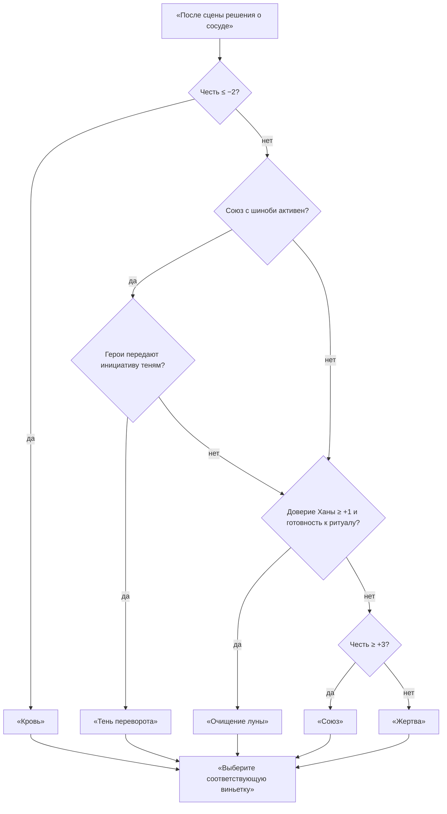

# 🌙 Тени цветущей луны — сценарий ведущего

> **Формат:** ваншот на 3–4 часа для дуэта игроков (см. [[09_Персонажи]]).
> 
> **Основа:** договор с духом кицунэ, лунный счётчик «Три удара гонга» ([[02_Сюжет]]), шкала Чести ([[08_Честь]]).
> 
> **Совет:** перед началом напомни игрокам, что их Честь — общий ресурс. Мир реагирует на их поступки сразу.

### Быт и культура

- **Рисовое вино «Серебряный цвет».** Его разливают в чаши с лепестками сакуры перед праздником Цветения Луны. Ведущий может упомянуть, что глоток отдаёт горечью, как только поблизости появляется скверна или ложь.
- **Одежда приглушённых тонов.** Жители носят хитатэ цвета пепла и инея, чтобы не привлекать духов. Почти у каждого на поясе висит кисточка с амулетом-лисой; персонажи часто касаются её, когда просят помощи или благодарят.
- **Табу ночного света.** После заката никто не выходит без фонаря — даже стража крепит тусклые лампы к поясу. Нарушение табу мгновенно вызывает шёпот NPC и предупреждение о «чужой тени».
- **Праздник Цветения Луны.** Каменные площади украшены серебряными лентами и гирляндами, но теперь они висят оборванными. Используй контраст «красивое → тревожное», напоминая, что праздник сорвался из-за тревог в храме.

### Знаки Чести (для ведущего)

Держи шкалу Чести за ширмой и показывай её через атмосферу.

- **Честь ≥ +2.** Туман становится прозрачнее, будто вдыхает вместе с героями; фонари раскрывают мягкие круги света, в которых слышится тёплый шёпот; удар гонга звучит чистым аккордом, оставляя ощущение поддержки; глаза каменных лисиц наполняются янтарным отблеском.
- **Честь от −1 до +1.** Мир колеблется: туман стелется ровно, фонари потрескивают, гонг отзывается глухим эхом, а статуи лишь мельком отражают лица героев — так ты подсказываешь, что баланс хрупок.
- **Честь ≤ −2.** Туман сгущается и цепляется за одежду, фонари вспыхивают резкими тенями, гонг гремит тяжело, будто предупреждая, а глаза лисиц темнеют или покрываются трещинами.

Используй эти образы до и после ключевых решений, чтобы игроки понимали, что мир «видит» их выбор, не называя чисел.

> 💡 **Подсказка о суевериях.** Когда герои колеблются или пытаются обмануть жителей, напомни о ночных табу: обувь, обращённая к храму носками, заставляет NPC нервно поправлять сандалии; взгляд в пруд в одиночку вызывает шёпот о вторых отражениях. Это простой способ показать, что ложь зовёт лисьи тени.

### Механика «Сплочённость»

> 💠 **Идея.** «Сплочённость» — это доверие между двумя героями, которое проявляется, когда они действуют плечом к плечу ради чести и добра. Она усиливает дуэт и подчёркивает, что их вера друг в друга способна менять ход истории так же, как Честь меняет отклик мира.

- **Запас зарядов.** В начале сессии дуэт получает 2 заряда «Сплочённости». Ведущий может открыть 3-й заряд, если игроки разыграли сильный момент взаимного доверия (общая клятва, признание вины и прощение, совместный риск ради жителей).
- **Как активировать.** Герои выбирают действие, которое выполняют синхронно или друг для друга. Обозначь короткую сцену доверия (жест, взгляд, слово) и попроси обоих подтвердить, что они действуют сообща.
- **Игровой эффект.** После описания активации предложи игрокам выбрать один вариант: получить преимущество на бросок одного из героев **или** добавить +2 к итоговому результату проверки/атаки/ритуала. Если действие направлено на морально благую цель (защита невинных, сохранение клятвы, искупление), начисли +1 к общей Чести сразу после сцены.
- **Примеры применения.**
  - *Совместная комбо-атака.* Один герой отвлекает Кацуру словами о клятве, второй наносит точный удар; «Сплочённость» даёт преимущество или +2 к попаданию.
  - *Поддержка ритуала.* Дуэт дышит в такт во время круга Ханы, и заряд позволяет повторить проверку или усилить результат, чтобы дух услышал их искренность.
  - *Синхронный социальный приём.* Один герой кланяется жителям, второй подтверждает обещание; бонус помогает убедить толпу или чиновника.
- **Ограничения и восстановление.** Заряд тратится один раз за сцену. Вернуть 1 потраченный заряд можно только после сильного ролевого момента доверия или искупления (например, герой раскрывает тайну напарнику, спасает его без расчёта на выгоду, приносит совместную жертву духам). Максимум заряды не накапливаются свыше 3.
- **Подсказки ведущему.** Предлагай «Сплочённость», когда:
  - дуэт стоит перед разделением путей Кая и Ханы — пусть решат, кто поддерживает кого;
  - сцена подчёркивает тему доверия (перед переговорами с Киёми, перед ритуалом Серебряной Чаши);
  - игроки сомневаются, хватит ли им ресурсов: напомни, что взаимная опора может заменить недостающие кубики;
  - Честь близка к нулю, но герои делают шаг к искуплению — дай шанс усилить моральный выбор механикой.

### How to read scenes aloud effectively

- Перед описанием сделай короткий вдох и отметь два-три ключевых образа; держи их перед глазами как план.
- Читай предложениями по 10–12 слов и оставляй паузы после каждой яркой детали, чтобы игроки успевали реагировать.
- Поддерживай голос жестами: если текст упоминает запах или звук, подчеркни его рукой или наклоном корпуса.
- Завершай блок вопросом или выбором, чтобы сразу вернуть слово игрокам и поддерживать темп.

| Сигнал | Моральное состояние, которое считывают NPC |
| --- | --- |
| Туман расступается и пахнет свежестью | Честь чиста, поступок одобрен духами |
| Фонари светят мягким серебром | Намерения искренни, жители готовы доверять |
| Гонг звучит напевно, вибрация лёгкая | Долг исполнен, совесть спокойна |
| Глаза лисиц сияют янтарём | Герой верен клятве, духи покровительствуют |
| Туман липнет, фонари бросают резкие тени | Честь пошатнулась, мир насторожен |
| Гонг гремит глухо, лисьи глаза темнеют | Поступок позорен, духи требуют искупления |

### Сенсорные сигналы

- **Высокая Честь.** Лунный свет сгущается в мягкие ореолы, шёпоты духов звучат как дальняя песнь, а воздух пахнет свежей росой и ладаном. Призрачные фигуры гладят кожу тёплым бризом, оставляя ощущение поддержки.
- **Колеблющаяся Честь.** Свет мерцает, будто свечи на ветру, туман шуршит по ногам, а в носу стоит запах влажной земли и железа. Духи наблюдают молча, касаясь лишь краем хвоста.
- **Низкая Честь.** Тени заглатывают свет, удары гонга режут слух металлическим скрежетом, а запах гари и крови наполняет лёгкие. Духи проявляются рывками и скребут когтями по доскам или броне.

### Horror Cues by Scene & Honor State

| Сцена | Высокая Честь | Колеблющаяся Честь | Низкая Честь |
| --- | --- | --- | --- |
| **2A. Вступление** | Безглазые лисицы склоняют морды, ветер несёт тёплый шёпот предков. | Пустотный порыв ветра гудит в обрыве, фонари колышутся. | Полый удар ветра швыряет песок в глаза, статуи плачут кровавым отблеском луны. |
| **2A. Этап 1** | Тени фонарей дрожат, но складываются в защитные силуэты союзников. | Дёргающиеся тени цепляются за сапоги, ледяной сквозняк пробирает до костей. | Тени рвутся с поводков, сквозняк тянет вниз, обещая сорваться в пропасть. |
| **2A. Этап 2** | Лопнувшая струна стихает, уступая место мягкому хору отражений. | Эхо сломанной струны висит в воздухе, язык сводит от металлического привкуса. | Тишина после удара струны звенит в ушах, привкус железа превращается в тошнотворную кровь. |
| **2A. Этап 3** | Серебряный пар тёплый, влага смягчает ладони. | Сырость поднимается по сапогам, стены дышат влажным холодом. | Холод колодца проникает в кости, цепи капают водой, будто плесенью обмазывают клятвы. |
| **2B. Вступление** | Лунные отблески чисты, ветер несёт запах риса и благовоний. | Кровавые всполохи на воде мигают, пустой ветер пульсирует между террасами. | Луна краснеет полностью, каждый удар ветра как приговор, фонари гаснут рывками. |
| **2B. Круг воды** | Сквозняк стихает, вода греет руки и шепчет имена защитников. | Ледяной сквозняк стучит зубами, вода тянет за запястья. | Холод вгрызается в кости, вода жжёт льдом и шепчет обвинения павших. |
| **2B. Круг дыхания** | Фонари поют ровно, тени танцуют мягкими волнами. | Тени вспыхивают, оборванная струна звенит в паузах песнопений. | Струна рвётся снова и снова, тени пляшут судорогой вокруг каждого лживого слова. |
| **2B. Круг памяти** | Мох тёплый, тени склоняются с уважением, багровый свет гаснет. | Ледяная сырость поднимается по коленям, багровые отблески мерцают на краю сада. | Земля сочится холодной влагой, тени табличек плачут кровавым светом и тянут имена вниз. |

### Ambient Event Triggers

| Сцена | Событие | Когда использовать | Подтекст |
| --- | --- | --- | --- |
| Акт I · Площадь ремесленников | «Шёпот налогового колокола» | Когда солдаты проверяют лавки или начинается спор о порядке | Напоминает о штрафах за поклонение духам, возвращая страх перед властью Кацуры. |
| Акт I · Площадь ремесленников | «Плач масок» | Во время паузы в диалоге или при падении Чести ≤ 0 | Кровавый лак и шёпоты масок напоминают, что сорванный праздник до сих пор болит у предков. |
| 2A · Путь Кая | «Серебряные вороны» | Когда герои замирают, выбирая маршрут | Стая несёт запах жертвенных костров, напоминая о нарушенной клятве Кая и цене силы. |
| 2A · Путь Кая | «След невесты» | После упоминания Амаи или при Чести < 0 | Призрачный силуэт требует искупления за исчезнувших, заставляя героев вспомнить о долгах. |
| 2B · Путь Ханы | «Слёзы фонарей» | Между кругами ритуала, когда герои берут паузу | Фонарь плачет тёплым паром, упрекая в забытых детях и усиливая давление милосердия. |
| 2B · Путь Ханы | «Белая хранительница» | При сумерках или падении Чести ≤ 0 | Фигура на воде следит за ритуалом, намекая на скрытые жертвы и требуя искупления. |

### Второстепенные духи: как вводить

- **Лунные огоньки.** Держи их как «живой указатель» перед развилками пути Кая или в моменты сомнений. Проговаривай, что свет складывается в лисьи хвосты, и предлагай выбор между безопасной тропой и заманчивым болотом с тайником. Проверка — **Мудрость (Выживание/Навигация)** КС 13; успех открывает подсказку или бонус, провал рождает моральную дилемму (усталость или трата Чести ради ресурса). При высокой Чести огоньки сами раскрывают верный путь; при низкой — подталкивают к риску, но оставляют шанс отказаться.
- **Проказник Сэнко.** Используй его на пути Ханы или в побочных сценах, чтобы добавить контраст без боя. Начни с пропажи мелочи у героя, затем предложи короткую социальную проверку (Харизма/Интеллект КС 13) или рассказ забавной истории. Успех возвращает предмет и даёт подсказку/переброс; провал — мягкое условие («верни вещь смехом или честностью») и напоминание о долге.
- **Мини-хореография.** Действуй по цепочке: *сигнал → выбор → проверка → напоминание о Чести → последствие*. Так духи ощущаются частью экологии, а не случайной встречи. Если времени мало, перескажи итог короткой сценкой: «Свет погас, но на сапогах осталась тина — учти помеху к следующей проверке Чести».
- **Безопасность дуэта.** Эти духи не наносят прямой урон. При провале всегда давай альтернативу: обмен Чести, смешная история, добровольный уровень усталости. Их цель — усилить тему «тени-лиса-луна» и наполнить мир, а не убивать героев.

### Настрой голоса и манер NPC

- **Киёми:** *[голос бархатный, тянущийся, иногда превращается в холодный звон; движения плавные, кисти рук будто рисуют в воздухе]*.
- **Кай:** *[говорит медленно, иногда эхом повторяет слова, ладони дрожат, взгляд расфокусирован]*.
- **Хана:** *[голос мягкий, но уверенный; когда нервничает — делает глубокий вдох, чтобы не сорваться на крик]*.
- **Кацура:** *[баритон с металлическими нотками, речь рубленая; держит подбородок высоко, руки за спиной]*.
- **Кагэхо:** *[шёпот, будто говорит из тени; редко смотрит прямо в глаза, постоянно меняет стойку]*.
- **Урабэ-баа:** *[скрипучий смех, тянет слова; жесты плавные, как у чайного мастера]*.
- **Йори и Рэн:** *[говорят поспешно, иногда перебивают друг друга; держатся близко, словно боятся потерять друг друга]*.
- **Духи моста:** *[голоса многоголосые, иногда звучат сразу с разных сторон, шёпот сопровождается прохладой]*.

### Памятка тона и речи

| NPC | Манера речи | Образы и паузы |
| --- | --- | --- |
| **Старейшина Кай** | Короткие фразы, тяжёлые как камень; говорит так, словно каждое слово — решение. | Делай долгие паузы и смотри прямо, будто оцениваешь вес обещаний. Упоминай мост, кровь, долг. |
| **Жрица Хана** | Мягкий голос с печальной ноткой; часто говорит метафорами воды и света. | Добавляй вздохи перед трудными словами, веди взглядом по кругу, будто проверяешь круг ритуала. |
| **Лорд Кацура** | Учтивые приветствия, за которыми скрыт холодный расчёт; вопросы формулирует как неизбежные сделки. | Держи голос ровным, почти любезным; используй слова «порядок», «служение», «покровительство». |
| **Киёми** | Певучие пары образов («свет — тень»); звучит так, будто сама луна шепчет через лёд. | Тяни гласные, смени тембр на звон, когда злится; оперируй образами хвостов, отражений и клятв. |

Используй эти характеристики перед каждой сценой, чтобы сразу погрузить игроков в эмоциональный тон встречи.

### Личные мотивы второстепенных NPC

- **Мэйко, ремесленница.** Хочет, чтобы брат Томо доказал, что традиционная резьба достойна покровительства Киёми. Она тайно прячет в мастерской письма к духу, опасаясь, что Кацура их найдёт. Если герои упомянут о сохранении ремесла, Мэйко готова рискнуть и помочь им спрятаться в доме Кая.
- **Йори.** Стремится показать, что дети могут влиять на судьбу деревни. Его мечта — стать хранителем фонарей и вернуть пропавшую сестру Сакуру. Он собирает слухи о солдатах и готов делиться ими с теми, кто обещает защиту.
- **Рэн.** Мечтает покинуть Мидзунохи и открыть лавку масок в столице, но не сделает этого, пока сестра не найдена. Рэн ищет в героях замену взрослым, которые боятся действовать, и предлагает им свои тайники в обмен на обещание.
- **Урабэ-баа.** Считает, что традиция важнее, чем личности. Её цель — удержать духи и людей в равновесии, чтобы мост не перестал «дышать». Если герои проявят уважение к её чайной церемонии, она раскрывает старые договоры.
- **Кагэхо.** Разрывается между приказами Кацуры и состраданием к жителям. Он тайно ведёт хронику нарушений коменданта и ищет, кому можно передать доказательства. Готов помочь героям, если увидит, что они готовы отвечать за последствия.
- **Тадао, монах-ученик.** Хочет доказать Хане и Каю, что достоин хранить алтарь. Его страх — снова потерять контроль над печатями. Он просит героев научить его стойкости и ищет возможности сопровождать их, чтобы чему-то научиться.
- **Страж Кацуры на площади.** Надеется спасти свою семью, которую держат заложниками в лагере. Он выполняет приказы с холодной маской, но шёпотом спрашивает, можно ли доверять Киёми. При обещании помощи готов закрыть глаза на поступки героев.
- **Юный подмастерье.** Влюблён в Сакуру и верит, что её исчезновение — знак Киёми. Он готов рисковать, чтобы освободить её, и ненавидит собственную трусость. Просит героев научить его хотя бы одному «геройскому» жесту.

### Баланс испытаний для 2 игроков

> 💡 **Ведущий:** Дуэт держит клинок ближе к горлу, чем кости судьбы. Пусть путники ощущают острие риска, но всегда видят узкий мост для ответа.

- **Светлая стратегия.** Учитывай, что герои, действующие честно, чаще выбирают переговоры, защиту и ритуалы. Снижая количество врагов до 1–2 значимых фигур, усиливай атмосферу: описывай, как туман сгущается до стен, как тени тянутся за клинками. Подчёркивай, что у NPC есть слабости и моральные крючки — это компенсирует уменьшенные числа.
- **Тёмная компенсация.** При общей Чести ≤ −1 предложи дуэту выбор **«Теневой аванс»**: каждый герой получает либо +1d4 к урону первой атаки сцены, либо 5 темп. хитов. Ответный риск — **«Отголосок тьмы»**: главный враг сцены получает +1d4 к первому броску атаки **или** 5 темп. хитов. Решение проговаривай вслух, чтобы тёмный путь был осознанным и тактически выгодным, но не бесплатным.
- **Поддержка NPC.** Назови условия, при которых помощь приходит автоматически: если герои спасали детей — Кацура, желая показать контроль, присылает двух арбалетчиков, которые один раз дают перекрёстный огонь (потом он потребует услугу); если дуэт совершил ритуал у мостов, дух-наставник может остановить один смертельный удар, но попросит цену. Делай оговорку, что помощь не отменяет выборы — она открывает новый узкий мост.
- **Обход штрафов.** Каждый раз, когда низкая Честь добавляет помеху, предложи обход: манёвр (акробатика, чтобы занять позицию и снять помеху), переговоры (назови поручителя среди NPC), ритуал (расход времени/ресурса), использование окружения (скидка сложности, если герой задействует фонарь, статую, воду). Так даже строгие штрафы становятся задачей, а не приговором.
- **Визуальное давление вместо чисел.** Когда уменьшаешь хиты или количество врагов, усиливай описания: кровь расплывается по снегу, фонари меркнут, у каждого удара есть отражение. Страх ощущается не количеством кубиков, а образами.

| Уровень Чести | Награды / риски | Способы преодоления |
| --- | --- | --- |
| **+2…+5** | Духи и жители готовы помогать; штрафы исчезают быстрее, NPC приходят сами. | «Светлая» стратегия: переговоры, защитные манёвры, открытые обещания. Используй фонари, воду, таблички как союзников — каждая сцена содержит подсказку на убеждение или ритуал. |
| **0…+1** | Мир насторожен, но не враждебен; стандартные проверки без помех. | Смешивай подходы: манёвры и окружение снимают отдельные сложности. Напомни игрокам о поручителях (Мэйко, Кагэхо, дети) и обыгрывай их поддержку. |
| **−1…−2** | Вводи «Теневой аванс»: герои получают боевое усиление, но враги отвечают «Отголоском тьмы». Социальные сцены стартуют с помехой. | «Тёмная» стратегия: контракты с Кацурой, игра на страхе. Обход штрафов — шантаж, ложные клятвы, скрытность, активные манёвры (например, разрушить фонарь, чтобы запугать противника). |
| **−3…−5** | Духи требуют плату; противники получают дополнительные угрозы (ауры, врем. хиты). NPC-помощь доступна только за явные уступки или ритуал. | Комбинируй обе стратегии: сначала тёмная выгода (аванс), затем искупительный манёвр (ритуал, спасение заложника) для снятия помех. Подчёркивай, что даже здесь есть путь: переговоры со страхом, обряды очищения, ловушки окружения. |

### Как пользоваться описательными блоками

- Перед каждой проверкой или заявленным осмотром вспомни, что игрокам важна **сенсорная опора**. Ниже ты найдёшь короткие абзацы, которые можно почти дословно зачитывать.
- Когда текст отмечен пометкой *(успех)* или *(провал)*, прочитай соответствующий вариант после броска. Если результат пограничный, смешай фразы или адаптируй их.
- Если герой тратит ресурсы (Честь, здоровье, заклинание), добавь маленькое дополнение: *[опиши, что именно герой отдаёт миру]*.
- При повторном осмотре меняй детали: упоминай, как следы становятся ярче, туман реагирует или NPC замечает внимание героев.

### Модульные развилки Акта II

- **Когда предлагать выбор.** До того как герои углубятся в путь Кая или Ханы, напомни им, что у них есть три опоры: влияние Кая, поддержка жителей, помощь духов. Спроси: *«Кого вы хотите привлечь?»* Затем повторяй этот вопрос перед ключевыми испытаниями в сценах 2A и 2B.
- **Что даёт успех.**
  - *Опора на Кая:* уменьшает количество противников или открывает социальные ходы. Успех — Кай делится ресурсом (лист маршрутов, письмо павших), Честь +1. Провал — Кай действует грубо, Честь −1 и пометка «Кай раздражён».
  - *Опора на жителей:* выдаёт карты, легенды или укрытия. Успех — +2 к следующей проверке исследования/истории, Честь +1. Провал — слухи о герое, отметь «Жители насторожены», следующий контакт с толпой КС +2.
  - *Опора на духов:* открывает ритуальные подсказки и благословения. Успех — преимущество на следующей мистической проверке или точный ответ на вопрос, иногда за цену Чести. Провал — трещина в фонаре, пометка «Духи требуют плату», первая проверка дальше с помехой.
- **Как отслеживать последствия.** В заметках держи трек «Кай / Жители / Духи». После каждой сцены отметь, кому герои дали обещания и выполнили ли их. Эти записи используются в финале для определения, кто приходит на помощь и какие проверки получают модификаторы.
- **Совет.** Всегда проговаривай, как выбор влияет на Честь. Даже если бросок не удался, озвучь реакцию мира: *«Клинки Кая звенят громче»* или *«Фонарь трескается, дух требует искренности»*.

---

### Побочные истории деревни

> 💡 **Опция.** Используй побочные сцены, когда игроки ищут передышку между путями Кая и Ханы. Они занимают 5–15 минут и легко сворачиваются до одного броска.
>
> Если времени мало, озвучь ставку, предложи выбор и сделай один проверочный бросок. Награды выдавай сразу, а последствия вплетай в атмосферу (фонари светлее, жители доверяют).

> 💬 **Ход с детской игрой.** Если герои ищут союз среди жителей, предложи им сыграть с детьми в «Лису и журавля». Победа через приглашение «стража луны» может дать им свидетельство верности перед старейшинами (преимущество на следующую социальную проверку или +1 к Чести, если они публично подтвердят своё обещание).

| История | Ключевой узел | Почётный выбор | Альтернативный выбор | Награда |
| --- | --- | --- | --- | --- |
| **«Плач фонарей»** ([[03_Сцены/Побочные_истории_Мидзунохи#🌾-История-1-Плач-фонарей-дед-Ёсиро-и-его-внук]]) | Обряд или сделка с тенью | Сострадательный ритуал: Честь +1, имя Амая | Сделка и страхи жителей: Честь −1 | Оберег тёплой памяти, союз семьи Ёсиро |
| **«След охотницы»** ([[03_Сцены/Побочные_истории_Мидзунохи#🌲-История-2-След-охотницы-Рику-ищет-жену-Аой]]) | Освобождение Аой | Вернуть через память: Честь +1 | Приманка/сделка: Честь −1 или −2 | Поддержка Рику, запах жжёного лотоса, чарка «Эхо охоты» |

- **Готовые диалоги:** [[04_NPC/Старик_Ёсиро#Истории-и-речи-для-чтения]], [[04_NPC/Рику_и_Аой#Разговорные-сцены]].

- **Когда вводить.** После первой сцены пути (2A/2B) или перед финальным штурмом. Оповести счётчик «Три удара гонга», чтобы игроки чувствовали цену времени.
- **Что, если пропустили.** Ёсиро и Рику не исчезают: они появляются в финале с собственными решениями (ребёнок болеет, Аой пропала). Награды не выдаются, но можно упомянуть, как деревня справляется без героев.
- **Как влияют на финал.** Колокольчик Ёсиро даёт переброс проверок на доверие; поддержка Рику добавляет один источник преимуществ в бою; подсказки об Амае и запахе лотоса упрощают переговоры с Каем/Киёми (см. разделы Акт III–IV).

### Ответы на вопросы игроков «почему»

> 💡 **Прими эти ответы как камни в русле.** Не открывай всю реку сразу: каждое «почему» должно всплывать через сцену, проверку или найденный предмет.

- **Почему Кай не разорвёт договор сам?** Его грех — подмена истинной жертвы. Он боится повторить ошибку и ждёт, кто подтвердит Честь делом. *Раскрывается* через чтение письма Кая (сцена 1.2) или видение лавины от Киёми при высокой Чести.
- **Почему Киёми угрожает деревне, если когда-то спасла её?** Она требует исполнения слова. Кацура исказил договор, и дух защищается. *Раскрывается* в Акте III через диалог или через подсказку Ханы из Подземного архива.
- **Почему Кацура готов пожертвовать жителями?** Он строит власть на страхе и прячет грех прошлого предательства. *Раскрывается* при взаимодействии с Кагэхо (Отчёт о заговоре) или на дуэли, если герой задаёт прямой вопрос «кого ты бросил?». 
- **Почему Хана поддерживает духов, рискуя жизнью?** Её молчание когда-то позволило исказить договор. Она хочет искупить вину милосердием. *Раскрывается* через обряд очищения или исповедь у фонаря раскаяния.
- **Почему Кагэхо не сменит сторону сразу?** Его семья заложники Кацуры, а его руки уже в крови. *Раскрывается* при проверке Проницательности КС 13 или когда герои спасают семью во время сцены 2_Путь.
- **Почему сакура у пруда светится белым?** Старейшины связывают её с богиней Ханадзукэ: пока клятвы держат, лепестки чисты. Намекни на это через NPC — Хана или дети напомнят, что нарушение слова окрашивает цветы розовым.

### Подсказки постепенного раскрытия мотивов

- **Акт I:** дайте игрокам вопросы без ответов — Хана избегает темы договора, Кай уклоняется от просьбы убить его. Лишь намёки: звон оберегов, дрожь голоса.
- **Акт II:** каждый источник информации раскрывает *часть* мотива. Жители говорят о страхе, Кагэхо — о приказах, духи — о предательстве. Не соединяй детали, пока игроки не зададут «почему» или не предложат поступок.
- **Акт III–IV:** когда герои действуют с высокой Честью, NPC сами открываются: Киёми показывает видения, Хана отдаёт архив, Кай вручает маску. При низкой Чести мотивы проявляются через угрозы — Кацура готовит штурм, Киёми забирает голос.

### NPC: мотивы → последствия в сценах

| NPC | Мотив / грех | Где срабатывает | Последствие для сцены |
| --- | --- | --- | --- |
| **Старейшина Кай** | Хочет искупить подмену договора, даже ценой жизни. | 1_Завязка (дом Кая), 3_Кульминация | Высокая Честь открывает видение лавины (подсказка к ритуалу); низкая — вызывает вмешательство Киёми и риск утраты контроля. |
| **Жрица Хана** | Стремится провести ритуал милосердия, исправив своё молчание. | 1_Завязка (храм), 2B_Путь Ханы | При высокой Чести ведёт в Подземный архив (−2 к КС ритуала); при низкой навязывает обряд очищения, задерживая прогресс. |
| **Лорд Кацура** | Скрывает прошлое предательство, хочет власти без духов. | 2_Путь (патрули), 4_Финал | Высокая Честь позволяет решить конфликт дуэлью; низкая запускает план «Стеклянный клык» и усиливает финальный бой. |
| **Киёми** | Требует исполнения договора, боится забвения. | 3_Кульминация, 4_Финал | Высокая Честь даёт «хвост памяти» и шанс перемирию; низкая лишает героя голоса и усиливает боевой сценарий. |
| **Кагэхо** | Живёт между приказом и совестью, защищает семью. | 1_Завязка (площадь), 2_Путь (засады) | Высокая Честь приносит карту патрулей (замена провала на успех); низкая приводит к блокпосту и предупреждению Кацуры. |

---

## Пролог — «Шёпот на мосту»

**Вход:** ночь перед рассветом, горная дорога в провинции Иэцу ([[01_Мир]]).

1. **Описание сцены.**
   - Воздух пахнет мокрым камнем и пеплом. Под ногами тянется подвесной мост, впившийся в туман.
   - Лампы загораются сами собой, когда герои приближаются, и высвечивают **лисий узор** на досках.
   - Вдалеке слышен первый удар гонга, едва различимый. Сделай паузу, опиши вибрацию в груди: при высокой Чести она поддерживает, при низкой — тревожит.
   - Приглядевшись, герои замечают капли на канатах. Они сползают, превращаются в серебристые бусины и отражают лица игроков янтарными глазами.
   - Сквозь туман видны силуэты кедров. Их ветви тянутся, как когти к мосту. Добавь свист ветра между досками и нотку холода.

2. **Мастерские пометки.**
   - *[говори вполголоса, делай акцент на дыхании героев]*
   - *[если Честь стартует ≥ +1, опиши, как каменные лисицы склоняют головы]*
   - *[если Честь ≤ 0, добавь запах железа; туман становится гуще]*

3. **Вступительный выбор.**
   - Герои видят **фонарь раскаянья** ([[06_Предметы#Фонари-раскаяния]]) на середине моста.
   - *Выбор А:* зажечь фонарь — проверка **Харизмы (Выступление)** КС 13. Успех: Честь +1, духи шепчут предупреждение о «сердце, где спит лиса».
   - *Выбор Б:* пройти мимо — фонарь гаснет; следующий контакт с духами в деревне начинается с помехи.
   - **Диалоговая заготовка фонаря.** *[тихий шелест, будто говорит сама лампа]*: «_Не забывай имена тех, кто ушёл. Если забудешь, огонь погаснет._»

4. **Знамение сна.**
   - Во сне (или медитации) одному герою является **Киёми** ([[04_NPC/Демон_Кицунэ]]). Она говорит образами: «Ты входишь туда, где слово было отдано и забыто». *[приглуши голос, добавь шёпот]*
   - Предложи игрокам сформулировать, что значит Честь для их героев. От этих слов зависят будущие видения.
   - **Если герои обсуждают сон между собой**, добавь реплику шёпота из тумана: *[эхом, едва слышно]* «_Честь — это фонарь. Я вижу, дрожит ли рука, которая держит его._»

5. **Переход в деревню.**
   - Как только герои ступают на землю Мидзунохи, гонг ударяет снова (официально — **первый удар** счётчика). *[ударь по столу или по книге, чтобы создать звук]*
   - Укажи на пульсацию света в фонарях: чем выше Честь, тем теплее сияние.

6. **Первое столкновение с наследием.**
   - Из тумана выходят два путника — **Йори** и **Рэн** (дети ремесленников). Они несут короб с куклами-кицунэ и ищут пропавшую сестру.
   - *Диалоговый крючок:* Йори шёпотом спрашивает, стоит ли возвращать куклы Кацуре. Герои могут обещать помощь (Честь +1) или отказаться (в дальнейшем дети рассказывают солдатам, что герои равнодушны — Честь −1).
   - Если кто-то проводит проверку **Истории** КС 12, вспоминает легенду о «семи укрытиях хвостов» — пригодится в Акте II при поиске тайных ходов.
   - **Реплики Йори и Рэн.**
     - *[Йори, дрожащим голосом, постоянно оглядывается]*: «_Господа, вы не видели нашу сестру Сакуру? Она ушла к фонарям у моста и не вернулась._»
     - *[Рэн, поспешно, перехватывая короб]*: «_Если Кацура узнает, что мы спрятали эти куклы, он пришлёт солдат и закроет мост. Поможете?_»
   - **Описание короба.** Деревянные куклы покрыты трещинами, из которых тонко сочится серебряный свет. При высокой Чести трещины затягиваются, при низкой — расширяются.
   - **Каменная лисица у входа на мост.** Её глаза отражают лица героев. Подскажи игрокам состояние Чести: сияние усиливается при доблести, гаснет при сомнениях.

7. **Галлюцинации мостовой стражи.**
   - Герои замечают, что на перилах моста вырезаны **семь зарубок**. Каждая соответствует моменту, когда дух вмешивался в судьбу деревни.
   - *[предложи игрокам потрогать воображаемые отметки]*. Проверка **Мудрости (Проницательность)** КС 13 позволяет услышать обрывок клятвы: «Если предам, хвосты станут пеплом». Откажись от разгадки — Честь не меняется, но при следующем общении с Киёми КС повышается на 1.
   - При Чести ≥ +1 зарубки подсвечиваются, демонстрируя путь к тайной лестнице (опциональная сцена в Акте I).
   - **Голос зарубок.** *[шероховатым тоном, будто говорит дерево]*: «_Семь раз мы спасали их. Восьмой — на вас._»
   - **Пульс тумана.** Перед каждым решением напомни, как туман реагирует: поддерживающая волна при высоких значениях, или холодный рывок назад при низких.

8. **Путевая виньетка «Дыхание ущелья».**
   - Пока герои идут к деревне, опиши, как туман прячется в карманах ущелья. *[рисуй руками волны воздуха, будто они обходят героев]*.
   - Добавь встречу с **стражем фонарей** — духом в виде светлячка.
     - *[тонкий, звенящий голос]*: «_Если ваша Честь чиста, я покажу короткий путь. Если нет, вам идти долго, пока ночь не кончится._» Проверка **Харизмы (Убеждение)** КС 12, чтобы заслужить доверие.
   - **Локационный акцент.** Укажи, что мост ведёт к террасам рисовых полей; вода в каналах отражает фрагменты звезд, но некоторые отражения моргают, словно живые.

#### Описательные блоки для проверок и осмотра

- **Осмотр фонаря раскаянья.**
  - *(до броска, спокойно, с любопытством)*: «_Под стеклянным колпаком пульсирует крошечная искра. Она будто ждёт, когда кто-то произнесёт имя, чтобы решиться вспыхнуть._»
  - *(успех проверки на Харизму)*: «_Пламя поднимается, и в воздухе расправляется струйка тёплого дыма. Она обвивает ваши пальцы, оставляя ощущение, будто вас благодарят за забытое обещание._»
  - *(провал)*: «_Искра дрожит и гаснет, оставляя запах холодной золы. Канаты моста протестующе скрипят, словно вы обидели кого-то невидимого._»
- **Прощупывание зарубок на перилах.**
  - *(до броска, шёпотом)*: «_Под вашими пальцами дерево кажется живым: оно втягивает тепло, реагируя на прикосновение, как кожа._»
  - *(успех проверки Проницательности)*: «_Каждая выемка звенит своим голосом. Одна говорит смело, другая — сдержанно. Они складываются в хоровой шёпот о долге._»
  - *(провал)*: «_Вы ощущаете только шершавость дерева и невнятный холод, будто мост не доверяет вам своих историй._»
- **Поиск тайн в тумане.** При любой попытке разведки опиши базовый слой: «_Туман расступается неохотно, словно вода вокруг лодки. На миг вы видите тёмный силуэт, но он тает, стоит только моргнуть._» Дополнительно:
  - *(успех проверки Восприятия)*: «_В слое тумана возникает лицевая маска с янтарными глазами, она кивком показывает на цепь фонаря или лестницу._»
  - *(провал)*: «_Туман затягивается плотнее, и в ушах появляется гул, как от далёкого барабана. На мосту становится чуть скользко._»
- **Реакция стража фонарей на проверку Убеждения.**
  - *(успех)*: «_Светлячок делает три круга вокруг головы говорящего, оставляя за собой нить серебристого света, ведущего к короткой тропе._»
  - *(провал)*: «_Огонёк меркнет и прячется в фонарь. Вы слышите, как по канату проходит ледяная дрожь — путь удлиняется._»

---

## Акт I — Завязка «Дом, где спит лисица»

### ★ Сцена 1. Площадь ремесленников

**Цель:** познакомить героев с напряжением между жителями и властью Кацуры.

- **Атмосфера.** Пахнет лаком и свежей бумагой, на лавках — маски кицунэ с трещинами. По краю площади стоят воины Кацуры.
  - Остатки праздника Цветения Луны цепляются за крыши: серебряные ленты колышутся на ветру и шуршат, будто кто-то шепчет. На мостовой ещё стоят чаши с рисовым вином; NPC предлагают героям сделать глоток и проверяют, не стала ли настойка горькой.
  - Лучи утреннего солнца пробиваются через бумажные стены лавок, рисуя силуэты ремесленников. Пыль в воздухе искрится, как мелкие снежинки.
  - Под масками слышен треск, будто внутри кто-то медленно вдыхает и выдыхает. Если Честь низкая, треск становится громче.
  - У ворот площади стоят две каменные лисицы. Их глаза могут тихо сиять, когда герои действуют по совести, или покрываться налётом, если Честь падает — отыграй это при каждом важном выборе.
  - Люди одеты в тусклые хитатэ и хаори цвета пепла; на поясах поблёскивают амулеты-лисы. Они то и дело касаются их, если герои задают вопросы.

> 🌫️ **Ambient Events.**
> - **«Шёпот налогового колокола» (когда солдаты осматривают лавки или герои спорят о порядке).** Над площадью раздаётся глухой звон колокола, хотя верёвка неподвижна. Воздух наполняется запахом холодного металла, и тень от колокола падает на случайного прохожего — это тот, чью семью когда-то оштрафовали за поклонение духам.
> - **«Плач масок» (во время затишья в диалоге или при падении Чести ниже 0).** С полок сползает красный лак, словно кровь, и маски раскрывают рты без звука. На ветру слышится хриплый шёпот предков, напоминающий о празднике, который сорвали солдаты Кацуры, — зрители чувствуют влажный запах пепла и старого риса.
- **NPC:**
  - **Мэйко, ремесленница** — просит помощи отыскать пропавшего брата.
  - **Страж Кацуры** — холоден, требует доказательств лояльности.
- **Механика.**
  - Проверка **Инсайта** КС 12 раскрывает, что солдаты боятся кого-то во тьме.
  - **Честь триггеры:**
    - Помочь Мэйко с подношением к пруду — Честь +1.
    - Согласиться шпионить для стражей — Честь −1, но даёт пропуск к мосту.
- **GM cues:** *[держи зрительный контакт с игроком, говорящим от лица своего героя]*, *[опиши, как треск масок усиливается при любой лжи]*.
- **Диалоговые заготовки.**
  - *[Мэйко, голос дрожит, она постоянно поправляет повязку на запястье]*: «_Герои, если увидите моего брата Томо у пруда, скажите, что мать ждёт его у фонаря. Боюсь, что его забрали люди Кацуры._»
  - *[Страж Кацуры, жёстко, но с ноткой усталости]*: «_На площади не место для сказок. Покажите, что вы за порядок, иначе окажетесь в темнице._»
  - *[Юный подмастерье, торопливо, полу шёпотом, поправляет фонарь на поясе]*: «_Хотите увидеть маску, которая сама издаёт звук? Я спрятал её. Только не выдавайте меня. И фонарь не снимайте — ночью без света даже тень чужая приходит._»

#### Осмотр площади и проверки

- **Исследование масок на лавках.**
  - *(общее описание)*: «_Под слоями лака проступают узоры, будто они были дорисованы в спешке. В каждой трещине блестит серебряная пыль, словно кто-то плакал внутри маски._»
  - *(успех проверки Расследования)*: «_Ты замечаешь, что линии ведут к символу хвоста, спрятанному под подбородком. Его можно использовать как знак поддержки._»
  - *(провал)*: «_Тебе удаётся лишь почувствовать тепло свежего лака. Хозяин лавки закрывает маску ладонью и настороженно смотрит._»
- **Выслушать толпу (Проницательность или Восприятие).**
  - *(успех)*: «_Шёпоты складываются в одно имя — «Сакура». Люди боятся, что она стала новой жертвой договора._»
  - *(провал)*: «_Голоса сливаются в гул, в котором слышен только сухой стук копий стражи._»
- **Социальная проверка со стражем.**
  - *(успех)*: «_Солдат слегка опускает плечи и позволяет вам пройти, бросая взгляд на капитана, чтобы убедиться, что его не видят._»
  - *(провал)*: «_Он громко стучит копьём по земле, и два других воина мгновенно обращают на вас внимание._»
- **Осмотр площади при низкой Чести.**
  - «_Лавочники торопливо гасят фонари, будто боятся, что ваш взгляд принесёт беду. Даже воздух здесь становится тяжелее._»

### ★ Сцена 2. Дом старейшины Кая ([[04_NPC/Старейшина_Кай]])

- **Готовый диалог:** [[04_NPC/Старейшина_Кай#Диалоговые-сцены]].

**Цель:** раскрыть тайну сосуда и создать эмоциональную привязку.

### Переходная сцена «Улица бумажных фонарей»

- **Описание.** Узкий переулок, фонари свисают на уровне плеч, их тени бегут по стенам, как лисьи хвосты. Бумажные гирлянды после праздника Цветения Луны разорваны, и каждый колышущийся клочок серебра скрипит, будто стон духов.
- **Сопровождение.** Позволь Мэйко или юный подмастерье идти рядом.
  - *[Мэйко, тихо, словно боится разбудить тени]*: «_Здесь раньше вешали желания. Теперь мы прячем их внутрь фонарей, чтобы солдаты не нашли. Если увидите пожелтевший шнур — это знак тех, кто верит Киёми._»
  - *[Подмастерье, заговорщицки, часто оглядывается и придерживает тусклый фонарь на поясе]*: «_Я вырезал на этом фонаре знак. Проведите по нему пальцем, и страж мостов услышит вас. Только не гасите — без света ночью нельзя, дед говорил, что лиса забирает тень._»
- **Механика.** Проверка **Интеллекта (Расследование)** КС 12 позволяет герою заметить узор «семи хвостов», открывающий кратчайший путь к дому Кая. Провал — фонари начинают гаснуть, создавая тревогу (следующий разговор с охраной сложнее на 1).
  - **Сигнал Чести.** Сделай паузу и опиши, как фонари реагируют на поступки героев: мягкий серебристый свет при честных словах, резкие тени и чад при лжи.

- **Вход.** Дом пропах благовониями, стены покрыты молитвами. В углу — алтарь с чашей рассветного серебра ([[06_Предметы#Чаша-рассветного-серебра]]).
- **Диалог.**
  - Кай говорит двойным голосом, иногда повторяя слова героев. *[говори чуть эхом, наклоняясь вперёд]*
  - Он просит героев помочь провести обряд у пруда, прежде чем дух окончательно проснётся.
- **Выбор.**
  - *Ритуал доверия:* герои читают **Письмо Кая** ([[06_Предметы#Письмо-Кая]]). Проверка **Религии** КС 14. Успех: Честь +1, Кай делится тайником (маска лисицы).
  - *Отказ или попытка запугать:* Честь −1, Кай закрывает дом, а ночью герои слышат вой лисы.
- **Знак Чести.** Если показатель ≤ −1, глаза Кая загораются лунным светом, и он говорит голосом Киёми: «Вторая ложь разрушит мост».
- **Диалоговые заготовки.**
  - *[Кай, устало, но с теплотой, кладёт ладонь на чашу]*: «_Каждая капля этого серебра напоминает мне голос деда. Боюсь, что скоро оно услышит только крики. Поможете сменить этот звук?_»
  - *[Кай, когда дух пробуждается, голос становится бархатным, но холодным]*: «_Я слышу, как у вас дрожат сердца, будто пламя фонаря. Хватит ли вам силы сдержать обещание?_»
  - *[Кай, с благодарностью, если герои проявляют уважение]*: «_Под татами спрятана маска. Она показывает правду. Возьмите её, если готовы смотреть на себя прямо._»

#### Описательные блоки в доме Кая

- **Осмотр алтаря и чаши.**
  - *(нейтрально)*: «_Чаша наполнена жидким серебром. На поверхности колышутся слабые волны, отражающие вас с янтарными глазами._»
  - *(успех проверки Религии или Магии)*: «_Серебро отзывается мягким звоном, будто приветствуя знакомую молитву. В отражении появляется силуэт женщины с девятью хвостами, склоняющий голову._»
  - *(провал)*: «_Свет внутри чаши тускнеет, и в комнате пахнет охлаждённым металлом. Кай нервно сжимает пальцами край стола._»
- **Поиск тайника под татами.**
  - *(успех проверки Расследования)*: «_Доски издают тихий щелчок, и воздух наполняется запахом старой бумаги. Маска внутри тёплая, будто её только что держали в руках._»
  - *(провал)*: «_Татами скрипит, но не поддаётся. Кай замечает попытку и мягко, но настойчиво просит не торопиться._»
- **Просьба прочитать письмо.** Если герои соглашаются, прочитай: «_«Я, Кай, сын Хару, признаю, что мост не должен молчать. Если мои слова солгут, пусть луна заберёт мою тень»._» После броска добавь один из вариантов.
  - *(успех Религии)*: «_Слова ложатся на воздух, как лёгкие перья. В комнате становится теплее, а дыхание Кая выравнивается._»
  - *(провал)*: «_Пламя свечи пригибается к земле, и Кай обрывает чтение, будто боясь, что дух обидится._»

### Межсцена «Дворик молитв»

- **Описание.** Каменный двор, украшенный колоколом. Лепестки сакуры падают в миски для омовений, оставляя серебряные разводы. На крыше храма зияют свежие проломы, туда ветер заносит обломки черепицы — Киёми каждую осень сбивает их хвостом, и хранители собирают осколки как предупреждение. Между колоннами висят почерневшие фонари с оборванными украшениями.
- **NPC сопровождающий:** монах-ученик Тадао.
  - *[Тадао, спокойным голосом, слегка прерывисто]*: «_Каждый удар гонга будто срезает у дерева ветвь. Когда луна доберётся до корней, дух проснётся полностью._»
- **Интерактив.** Герои могут ударить в малый колокол (проверка **Мудрости (Религия)** КС 11). Успех: получают благословение (один раз могут добавить 1d4 к броску защиты от чар). Провал: звук привлекает стражу — следующая встреча с солдатами проходит напряжённее (КС социальных проверок +1).

#### Колокол и ритуальные омовения

- *(до броска, мягко)*: «_Колокол покрыт патиной. Лёгкий слой инея на его краю слабо светится, будто ждёт чьего-то прикосновения._»
- *(успех проверки)*: «_Звон разносится ровной волной. Лепестки сакуры поднимаются от пола и в воздухе складываются в знак, похожий на лисий хвост._»
- *(провал)*: «_Звон выходит коротким и хриплым. Воробьи на крыше вспархивают и улетают, будто испугались чужака._»
- **Омовение рук (без броска или по просьбе игроков).**: «_Вода холодная, но под кончиками пальцев будто вспыхивают искры. Когда вы поднимаете руки, серебристые дорожки стекают по кистям, оставляя чувство ясности._»

### ★ Сцена 3. Ночная стража у моста (камео [[04_NPC/Шиноби_в_тени]])

- **Готовый диалог:** [[04_NPC/Шиноби_в_тени#Диалоги-в-сценах]].

**Цель:** представить выбор между приказом и состраданием.

- **Обстановка.** Серебристый туман, звучат барабаны со стороны лагеря Кацуры. На мосту — Кагэхо, шиноби.
- **Сюжет.** Он предлагает сделку:
  - **Вариант «Клинок»:** помочь ему перенести печать, чтобы ослабить храм — Честь −1, но герои получают отчёт о заговоре.
  - **Вариант «Тень»:** убедить его помочь деревне — проверка **Убеждения** КС 14. Успех: он станет союзником в Акте II (даёт преимущество на проверку Стелс). Провал: сообщает Кацуре, стражники усиливают охрану — сдвинь счётчик «Трёх ударов» вперёд (второй удар прозвучит в начале следующей сцены).
- **GM cues:** *[говори шёпотом, смотри мимо игроков, будто следишь за невидимым наблюдателем]*.
- **Диалоговые заготовки.**
  - *[Кагэхо, шёпотом, постоянно оглядывается]*: «_Кацура велел бить в барабаны, как только мост оживёт. Если я оставлю их молчать, прикроете меня?_»
  - *[Кагэхо, голос становится твёрдым, если герои обещают помощь]*: «_Я умею исчезать в тумане. Скажите, кому доверяете, и я подставлю ему свой клинок._»
  - *[Скрытый наблюдатель, глухое эхо]*: «_Они уже идут. Мосту всё равно, будет кровь или молитва. Решайте, кто сделает первый шаг._»

#### Осмотр поста стражи

- **Проверка Стелс во время подхода.**
  - *(успех)*: «_Туман будто помогает, заглатывая ваши шаги. Канаты моста вибрируют еле заметно, но не издают звука._»
  - *(провал)*: «_Под ногой хрустит влажная доска. Кагэхо мгновенно поворачивает голову, и туман напрягается, словно струна._»
- **Осмотр барабанов и сигналов.**
  - *(нейтрально)*: «_Рядом лежит маленький барабан с натянутой кожей, на которой выжжено имя Кацуры. От него тянется тонкий шнур к колоколу._»
  - *(успех проверки Расследования)*: «_На внутренней стороне видно слабую трещину; если ударить в нужный момент, звук будет глухим и сигнал не услышат._»
  - *(провал)*: «_Ты замечаешь только идеально натянутую кожу. Кажется, стоит дотронуться — и звук разлетится по всей долине._»
- **Реакция Кагэхо на социальные проверки.**
  - *(успех Убеждения)*: «_Его плечи расслабляются, и он слегка наклоняет голову, признавая вашу решимость. Из рукава он достаёт чертёж патрулей._»
  - *(провал)*: «_Кагэхо отступает в тень, а из тумана выступает ещё один силуэт шиноби. В воздухе чувствуется запах острого перца — сигнал тревоги._»

#### Боевой блок «Засада разбойников тумана»

**Когда использовать:** если герои решают идти в обход поста или шумят, привлекая нежданных гостей, запусти стычку с мелкой бандой, работающей на Кацуру.

- **Состав врагов.** 3 **разбойника** (используй стандартный блок из Книги монстров или адаптируй по [[05_Монстры]]) и 1 **контрабандист-балалаист** (шаблон Ветерана с духовым амулетом, наносящим звуковой урон). При Чести ≥ +1 разбойники начинают с помехой на свои первые броски атаки; при Чести ≤ −2 они, наоборот, получают преимущество на первый раунд.
- **Поле боя.** Узкий участок моста с двумя подвесными корзинами с фонарями. Раз в раунд кидай d4: на 1–2 фонарь срывается и падает, оставляя зону тусклого света (помеха на дальние атаки), на 3–4 — обнажает тайную доску, через которую можно сбросить врага.
- **Тактика.** Разбойники пытаются сбить героев в туман, используя Захваты. Контрабандист бьёт по канатам, заставляя мост качаться (проверка Ловкости Сл 13, иначе спасбросок на удержание равновесия). Если герои пощадят пленённого, получат доступ к схрону с припасами (2 зелья лечения, свиток Ложной жизни).
- **Модификаторы Чести.** Пощадить и убедить разбойников отступить — Честь +1. Убить сдающихся — Честь −1 и слух о жестокости распространяется к лагерю.
- **Реплики.**
  - *[Лидер разбойников, срывающимся голосом]*: «_Кацура платит серебром за любую кровь. Не мешайтесь — и мы забудем, что видели вас._»
  - *[Контрабандист, играя на амулете]*: «_Слышите, как трос натягивается? Ещё миг — и вы сорвётесь._»
- **GM cues.** *[покачивай корпусом, чтобы показать раскачку моста]*, *[добавь ритм лёгкими постукиваниями по столу — это удары канатов]*.

### ★ Сцена 4. Пруд предков ([[01_Мир#Шёпот-воды]])

**Цель:** дать первое видение связи Кая и Киёми.

- **Ритуал.** Герои бросают в воду маску или монету. Проверка **Мудрости (Восприятие)** КС 14.
  - Успех: видят сцену древней лавины, слышат голос Киёми: «Я выбрала сердце, потому что они забыли моё имя».
  - Провал: вода затягивает, герой видит собственный страх. Следующая социальная проверка с Киёми с помехой.
- **Влияние на Честь.** Сострадание к душам пропавших (слушать их имена, обещать помощь) — Честь +1. Попытка скрыть правду — Честь −1.
- **GM cues:** *[делай длинные паузы после вопросов духов]*, *[опиши запах мокрого железа при низкой Чести]*.
- **Диалоговые заготовки.**
  - *[Голос Киёми из глубины, мягкий, но с угрожающей вибрацией]*: «_Вы пришли к моему пруду и говорите о Чести. Опустите руки в воду и скажите, что останется на пальцах._»
  - *[Хор предков, разные тембры, перекликаются]*: «_Назови того, кого не успел спасти. Если промолчишь, вода скажет сама._»
  - *[Призрачная девочка, тоненький голос]*: «_Я держалась за руку сестры и уснула. Проснулась в темноте. Вы проведёте меня домой?_»

#### Описательные блоки у пруда

- **Осмотр водной глади.**
  - *(до броска)*: «_Вода неподвижна, как зеркало. Лепесток, упавший на поверхность, не тонет — он будто зависает между мирами._»
  - *(успех проверки Восприятия)*: «_Под поверхностью мелькают силуэты лиц. Одно из них открывает глаза и шепчет имя, которое уже звучало на площади._»
  - *(провал)*: «_Вода остаётся темной. Только собственное отражение смотрит на тебя, и его глаза кажутся чуть более хищными._»
- **Погружение рук (при ритуале).**
  - *(успех)*: «_Холод пронзает до костей, но внутри ладоней остаётся мягкое тепло, как от только что затушенного фонаря. Духи принимают жертву._»
  - *(провал)*: «_Вода мгновенно обжигает, и по коже пробегают серебряные трещинки. Они исчезают, но оставляют тревожный холод._»
- **Реакция духов на обещание помочь.**
  - *(Честь +1)*: «_Фонари вокруг пруда разгораются, и один из них отрывается от земли, сопровождая говорящего на несколько шагов._»
  - *(если герои лгут)*: «_На поверхности появляется круг из тёмных пузырей. Из глубины слышен разочарованный вздох._»

**Завершение акта.** Как только герои выполнят минимум две сцены, ударяет **первый гонг** (если ещё не был объявлен). Опиши, как лунный свет трескается на статуе. Акт II начинается либо с утреннего собрания, либо с известия о пропаже жрицы Ханы.

### Сцена 5. Чайный дом Урабэ (опционально)

**Цель:** раскрыть гражданский взгляд на конфликт и дать героям союзников среди простых жителей.

- **Атмосфера.** Пар и аромат зелёного чая, на стенах — каллиграфия с иероглифами «терпение» и «память». Лёгкий звук котом, бьющегося о край чаши.
- **NPC:**
  - **Урабэ-баа**, старая хозяйка — хранит хроники деревни и слухи о Кацуре.
  - **Юдзиро**, молодой поэт, мечтающий увидеть духа.
- **Диалоговые сцены.**
  - Урабэ рассказывает, что Кацура запретил говорить имя Киёми на площади. *[говори низким, немного скрипучим голосом]*
  - Она предлагает героям прочитать строчки из её дневника. Проверка **Истории** КС 12 раскрывает старый пароль к тайной библиотеке.
- **Выборы.**
  - *Принять гостеприимство:* герои оставляют символ (например, оружие) у входа, получают вдохновение и поддержку жителей (одна бесплатная «поддержка толпы» в Акте II). Честь +1 за уважение.
  - *Отказаться и торопиться:* Урабэ обижается, слухи на рынке становятся холоднее — все проверки социальных навыков в деревне до конца акта с помехой.
  - **Мини-игра «Камни чая».**
    - Урабэ предлагает сыграть в расстановку горячих камней на доске (интеллектуальная дуэль). Три раунда проверок **Интеллекта (Анализ)** КС 12. Награда — свиток с маршрутами патрулей Кацуры.
- **GM cues:** *[опиши, как пар рисует лисьи силуэты в воздухе]*, *[постукивай пальцами по столу, имитируя стук котом]*.
- **Диалоговые заготовки.**
  - *[Урабэ, скрипучим голосом, мягко усмехаясь]*: «_Мы когда-то заваривали чай для самой Киёми. Говорят, ей нравился запах дыма. А вы что принесли мосту: новости или надежду?_»
  - *[Юдзиро, восторженно, глаза сияют]*: «_Я слышу, как вы шагаете в одном ритме. Как мне записать вас: как людей тени или света?_»
  - *[Скрытый клиент, нервно постукивая по столу]*: «_Солдаты ищут тех, кто говорит о семи хвостах. Если встретите Кагэхо, передайте: «Лиса ждёт в чайнике»._»

#### Осмотр чайного дома и мини-игры

- **Подача чая.**
  - *(описание)*: «_Чайник выпускает струйку пара, которая складывается в форму хвоста. Капли конденсируются на столе, образуя маленькие круги, как волны на пруду._»
- **Проверка Истории по дневнику.**
  - *(успех)*: «_Строки дневника вспыхивают лёгким светом, и ты читаешь: «Семь хвостов спрятаны в семи чашах, но только одна наполнена чистой водой»._»
  - *(провал)*: «_Чернила расплываются, и Урабэ мягко забирает книгу, говоря, что воспоминания не любят торопливых рук._»
- **Мини-игра «Камни чая».**
  - *(успех раунда)*: «_Горячий камень трещит и отпечатывает на доске символ ветра. Урабэ удовлетворённо кивает._»
  - *(провал раунда)*: «_Камень остывает слишком быстро, и по комнате прокатывается слабый холодок. Юдзиро записывает это в свои стихи._»
- **Осмотр хроник.**
  - *(успех Расследования)*: «_Между страниц спрятан свиток с рисунком моста. На обороте — знак, совпадающий с тем, что вы видели на фонарях._»
  - *(провал)*: «_Свитки складываются обратно сами собой, словно ты услышал щёлкнувший замок из воздуха._»

### ★ Сцена 6. Тайная лестница «Семь хвостов»

**Цель:** дать шанс на скрытую подготовку, если герои нашли зарубки на мосту.

- **Доступ.** Необходимы подсказки из пролога или помощь детей Йори и Рэн. Три проверки навыков в свободном порядке (квест-чеклист):
  1. **Ловкость (Акробатика)** КС 13 — пройти по разломанным ступеням.
  2. **Интеллект (Расследование)** КС 13 — найти скрытый рычаг в форме лисьего хвоста.
  3. **Мудрость (Восприятие)** КС 14 — заметить символы договора.
- **Награда.** Герои получают доступ к «Хранилищу голосов» (мини-сцена):
  - Найденные **шепчущие маски** позволяют задать по одному вопросу духам предков (ответ короткий, но правдивый). Спросите: «Кто солгал?» — получите имя Кацуры, «Что потеряла Киёми?» — узнаете о её сестре Аой (можно использовать в Акте III).
- **Риск.** При провале любой проверки один герой получает уровень усталости из-за колеблющегося мостика. Честь не меняется, но последующие проверки в тумане с помехой.
- **GM cues:** *[приглуши голос, словно говоришь из пещеры]*, *[если игроки задают вопросы маскам, наклоняй голову в сторону, будто слушаешь ответ]*.
- **Диалоговые заготовки.**
  - *[Шепчущая маска «Север» шипяще]*: «_Спроси меня о лжи, и я покажу лицо того, кто её сказал._»
  - *[Шепчущая маска «Запад», бархатный голос]*: «_Лестница ведёт вниз. Что вы оставите там?_»
  - *[Эхо Киёми, если герои задают вопрос о её сестре]*: «_Аой смеётся там, где нет мостов. Скажи ей про цветущую луну, и она покажет путь._»

#### Описательные блоки лестницы

- **Спуск по ступеням (Акробатика).**
  - *(успех)*: «_Сломанные ступени послушно принимают ваш вес. Туман стелется по ногам, но отступает, когда вы делаете шаг._»
  - *(провал)*: «_Доска хрустит, и на мгновение вы чувствуете пустоту под ногами. Канаты жалобно стонут, словно предупреждают._»
- **Поиск рычага (Расследование).**
  - *(успех)*: «_Пальцы находят холодный металлический хвост, спрятанный в углублении. Когда его поворачиваешь, стены вздыхают и открывают нишу._»
  - *(провал)*: «_Каждая выемка кажется одинаковой. Туман уплотняется, скрывая детали, и приходится тратить больше времени._»
- **Слушание голосов (Восприятие).**
  - *(успех)*: «_Шёпоты сливаются в ясную фразу: «Не торгуй хвостом, если не хочешь потерять сердце». Ответы масок становятся конкретнее._»
  - *(провал)*: «_Голоса спорят, перебивая друг друга. В голове возникает лёгкое эхо, мешающее сосредоточиться._»

### ★ Сцена 7. Разведка лагеря Кацуры (переход в Акт II)

**Цель:** дать игрокам возможность превентивно повлиять на силу противника.

- **Подготовка.** Герои подходят к лагерю на окраине. Ночью слышны барабаны. Используйте механику скрытности: требуется два успеха по **Ловкости (Стелс)** КС 14 до одного провала.
- **Объекты интереса.**
  - **Палатка сигнальных барабанов.** Уничтожение или перенастройка уменьшает риск ускоренного второго удара гонга.
  - **Клетка с духом-огоньком.** Освобождение существа приносит помощь в Акте III (раз в сцену можно осветить тайну и снять помеху).
  - **Сундук с приказами.** Проверка **Интеллекта (Расследование)** КС 15, чтобы понять план Кацуры. Успех: узнайте, что он готов использовать печать, если герои откажутся.
- **Выбор.**
  - *Оставить лагерь нетронутым:* Честь +1 за уважение к воинскому кодексу, но Кацура сохраняет полную силу.
  - *Саботировать:* за каждое действие проверка **Ловкости (Скрытность)**. Успехи ослабляют врага, но если пойманы, Честь −2 и начинается ранний конфликт.
- **GM cues:** *[говори резко и коротко, когда описываешь команды солдат]*, *[используй пальцы, чтобы отсчитывать успехи и провалы]*.
- **Диалоговые заготовки.**
  - *[Сержант Кацуры, командный голос]*: «_Барабанщики! По сигналу — два удара, один вдох. Никто не должен пройти без печати._»
  - *[Заключённый дух-огонёк, тонкий звенящий голос]*: «_Отпустите меня — и я озарю их ложь. Держите меня — и тьма сглотнёт вашу честь._»
  - *[Шпион деревни, тихим шёпотом из палатки]*: «_В ящике под столом приказы Кацуры. В них есть слово, которого боится Киёми._»

#### Осмотр лагеря и проверки

- **Слежение за патрулями (Стелс).**
  - *(успех)*: «_Вы успеваете синхронизироваться с шагами солдат. Их доспехи звенят в унисон, и этот звук становится вашим укрытием._»
  - *(провал)*: «_Колокол в отдалении ударяет, и патруль ускоряет шаг. Один из солдат щурится, пытаясь рассмотреть силуэты в тени._»
- **Взлом сундука с приказами.**
  - *(успех проверки Воровского дела или Расследования)*: «_Замок щёлкает тихо, как вдох. Внутри — свитки с печатями и запах сухого риса. На полях кто-то оставил символ лисего хвоста._»
  - *(провал)*: «_Свиток рвётся, и сухой треск разносится под палаткой. Сержант поднимает голову, настороженно вслушиваясь._»
- **Осмотр клетки духа.**
  - *(успех проверки Магии или Природы)*: «_Огонёк расширяется и принимает форму маленькой лисицы. Она благодарно кивает и обещает разогнать любую иллюзию._»
  - *(провал)*: «_Свет внутри клетки дрожит и обжигает пальцы, если попытаться коснуться. Дух отворачивается._»
- **Реакция лагеря на саботаж.**
  - *(при обнаружении)*: «_Барабаны взрываются как гром, и лагерь вспыхивает десятками факелов. Кацура выезжает из большой палатки, его голос режет ночь._»

---

### ★ Сцена 8. Фонари у моста — спасение Сакуры и Томо (финал Акта I / пролог Акта II)

**Цель:** вернуть пропавших детей и показать, как Честь меняет отношение духов и людей перед главным конфликтом.

- **Локация.** Полуразрушенный павильон у подвесного моста. Фонари-раскаяния раскачиваются над водой, а у перил видны следы борьбы. За щитом из бамбука — импровизированная клетка с Томо и привязанная к столбу Сакура. Над ними парят три лисих огонька, отзываясь на каждое слово.
- **Вход в сцену.** Герои получают наводку от Йори и Рэн после любой сцены Акта I или обнаруживают лагерь при отходе от базы Кацуры. Если Честь ≥ +1, дух стража фонарей подсвечивает короткую тропу. При Чести ≤ 0 туман сгущается — проверки Скрытности и Восприятия проходят с помехой.
- **Проверки и варианты подхода.**
  - **Тихое освобождение.** Требуются два успеха по **Ловкости (Стелс)** КС 13 до одного провала. Успех: герои снимают охрану, не поднимая тревоги, Честь +1. Провал: один из стражей Кацуры замечает их — сцена переходит в переговоры или бой.
  - **Переговоры с дозором.** Проверка **Харизмы (Убеждение или Обман)** КС 14. Успех: страж сдаётся, раскрывая, что Кацура готовит жертвоприношение ради власти над Киёми; герои освобождают пленников, Честь +1, если пощадят охрану. Провал: дозор пытается увести Сакуру к лагерю, Честь −1 за бездействие.
  - **Ритуальный вызов духов.** Предложите герою потратить 1 ячейку заклинания или 1d4 хитов и провести проверку **Мудрости (Религия)** КС 15. Успех: огоньки разрывают путы, Киёми посылает видение о сердечной печати Кацуры — сцена переходит в Акт II с бонусом (один раз можно повторить провал на проверке против Кацуры). Провал: духи сомневаются, Честь −1, Томо начинает терять сознание.
- **NPC и реакции.**
  - **Йори** (появляется из кустов, если герои шумят): «_Я привёл вас, потому что верю! Не дайте им забрать Сакуру, пожалуйста!_» При успехе сцены он обещает тайники на рынке (бонус к проверкам Расследования в Акте II). При провале уходит, обвиняя героев, Честь −1.
  - **Рэн** держит маску-талисман: «_Мэйко сказала, что огонь слушается только честных сердец. Вы ведь честные?_» Если герои успокаивают её проверкой **Мудрости (Проницательность)** КС 11, она отвлекает стражей, давая преимущество на следующий бросок. Провал: она бросается к Сакуре и попадает в плен.
  - **Мэйко** прибегает позже, когда всё решено. Если оба ребёнка спасены, она вручает героям семейный резец (даёт бонус +1 к проверкам, связанных с ремеслом, и может разорвать печати Кацуры в кульминации). Если провал — Мэйко обвиняет себя, Честь −1, но обещает помочь в обмен на месть.
- **Исходы и Честь.**
  - **Полный успех (спасены оба, стражи не убиты).** Честь +2 суммарно; мостовые духи усиливают свет фонарей, Киёми шепчет о слабости Кацуры к именам детей.
  - **Частичный успех (спасён кто-то один или стражи убиты).** Честь +0, но на рынке распространяются слухи о жестокости; Кацура ускоряет подготовку печати (в Акте II второй удар гонга может прозвучать на одну сцену раньше).
  - **Провал (дети уведены или ранены).** Честь −2; Киёми посылает образ горящего моста, а Кацура получает моральное преимущество — в следующей встрече его проверки Запугивания получают преимущество.
- **Связь с конфликтом Киёми и Кацуры.** Спасённые дети рассказывают, что Кацура собирался использовать их голоса в печати, чтобы заставить Киёми подчиниться. При высокой Чести Киёми посылает благословение (можно один раз в Акте II отменить негативный эффект гонга). При низкой Чести Кацура распространяет листовки о «лживых героях», и жители начинают сомневаться — все социальные проверки против сторонников Кацуры повышаются на 1 КС.

---

## Акт II — Конфликт и открытие «Ступени каменных лисиц»

### ★ Сцена 1. Рынок под лунным светом

**Посыл:** жители готовятся к празднику Цветущей Луны ([[01_Мир#Праздники-и-ритуалы]]), но в глазах страх.

- **Механика толпы.** Проведите короткий навык-челлендж (3 успеха до 2 провалов).
  - **Убеждение** — вселить надежду; успех приносит волонтёра, готового помочь нести благовония.
  - **Проницательность** — заметить, кто саботировал обереги (подпись Кацуры).
  - **Выступление** — рассказать легенду о Киёми. Успех: Честь +1, жители предлагают фонари.
  - Провал любого броска ускоряет приближение второго гонга.
- **GM cues:** *[давай игрокам говорить от лица своих героев, реагируй руками — жестами]*.
- **Диалоговые заготовки.**
  - *[Торговка благовониями, оживлённо, но с дрожью]*: «_Возьмите эти палочки. Если зажжёте их у пруда, духи услышат, что мы всё ещё помним их имена._»
  - *[Старик рассказчик, хрипло, смеясь]*: «_Когда-то Киёми любила яблоки. Теперь каждый откусанный плод — как печать на договоре. Хотите попробовать?_»
  - *[Солдат Кацуры, сухо, настороженно]*: «_Соблюдайте порядок. Любой, кто произносит имя лисы, будет доставлен к капитану._»

#### Описательные блоки рынка

- **Осмотр лавок с благовониями.**
  - *(нейтрально)*: «_Запахи смешиваются в тёплый шлейф: древесина, цитрус и лёгкая горечь полыни. Фонари над лавками мигают в такт дыханию торговцев._»
  - *(успех проверки Проницательности)*: «_Одна из связок благовоний перевязана ниткой цвета луны — знак подпольщиков, готовых помочь._»
  - *(провал)*: «_В нос ударяет резкий запах жжёного риса, и на глаза выступают слёзы. На мгновение сложно сосредоточиться._»
- **Навык-челлендж — успех сцены.**
  - *(после третьего успеха)*: «_Толпа начинает подпевать старой песне о мосте. Люди поднимают фонари, чтобы подсветить вам путь._»
  - *(при двух провалах)*: «_Над площадью гаснут сразу три фонаря. В воздухе повисает тревожная пауза, слышны только шаги солдат._»
- **Осмотр саботированных оберегов.**
  - *(успех Расследования)*: «_На обратной стороне бумажного талисмана виден тонкий разрез. Между слоями спрятан знак Кацуры — небольшая печать с его именем._»
  - *(провал)*: «_Бумага рассыпается от прикосновения, и торговец в ужасе просит не трогать святыни._»

### ⚖️ Развилка доверия: путь Кая или путь Ханы

- **Момент выбора.** После спасения детей или разговора в доме Кая попроси игроков решить, чьему плану они верят. Это переход к сцене исследования. Если герои колеблются, дай каждому по одному вопросу:
  - *К Каю:* «_Что докажет тебе, что сила важнее тайн?_»
  - *К Хане:* «_Готов ли ты раскрыть свои страхи ради духа?_»
- **Условие перехода.**
  - Честь ≥ 0 делает оба пути доступными.
  - Честь ≤ −1 вызывает давление: люди Кая настаивают на ударе, Хана требует ритуальной очистки. Игроки могут потратить 1 пункт Чести, чтобы убедить несогласную сторону и всё равно выбрать.
- **Подсказки Мастеру.**
  - Помни, что выбор влияет на отношение NPC: отметь, кто записывает действия героев (ученики Ханы или стражи Кая).
  - Напоминай про счётчик гонга — на пути Кая его ускоряют боевые провалы, на пути Ханы — задержки в ритуалах.

### ★ Сцена 2A. Путь Кая — «Под клинками луны»

Полное описание см. в [[03_Сцены/2A_Путь_Кая]]. Ниже — подсказки для проведения.

- **Фокус сцены:** прямое столкновение с шиноби и агрессивными духами.
- **Вопрос игрокам:** «Что ваш герой готов разрушить ради спасения деревни?»
- **Перед началом.** Напомни о трёх опорах: приказ Кая, помощь жителей, лунный ритуал. Спроси, на что они делают ставку, и отметь выбор в треке «Кай / Жители / Духи».
- **Честь-модификаторы.** При Чести ≥ +2 убери одного солдата (используй самого слабого противника сцены) и дай героям преимущество на первую проверку **Ловкости (Акробатика)** или **Силы (Атлетика)**. При Чести ≤ −2 добавь в засаду одного шиноби-ветерана (AC 15, хиты 45) и назначь помеху на первую проверку Стелс героев.
- **Этапы и сигналы.**
  1. **Засада шиноби.** Следи за здоровьем Кая; когда он ранен, спроси: «Сдержишь ли ты его ярость или позволишь добить врага?» Провал спасброска Чести КС 11 запускает вторую волну: добавь двух шиноби-лазутчиков (используй статблок «шпион») и дай им преимущество на первый бросок атаки.
  2. **Галерея отражений.** Опиши зеркальные стены. За каждый потраченный пункт Чести напомни игрокам, что мир слышит их клятвы. Используй фразы: *«Отражение повторяет твои слова другим тоном»*, *«Имя Амая звучит, как удар колокола»*.
  3. **Сторожевой колодец.** Предложи выбор между силой, умением и жертвой Чести. Если герои выбирают разрушение, отметь, что Хана узнает об этом через слухи.
  - **Честь и последствия.**
  - Сострадание и контроль дают Честь +1…+2; жестокость и невнимание к пленным — Честь −1…−2.
  - После сцены запиши отношение NPC: Кай предоставляет доступ к своим людям (один раз до конца Акта II получи преимущество на проверку **Харизмы (Запугивание)** или **Силы (Атлетика)** против его стражей), а монахи Ханы встречают героев холодно (социальные проверки с ними КС +1).
- **Подсказка по ветвям.**
  - *Приказ Кая:* если успех, убери одного врага и дай кодовую фразу. При провале объяви, что Кай действует самостоятельно и снижает Честь на 1.
  - *Сеть жителей:* напомни про карту ловушек. Успех даёт автоматическое избегание первой ловушки; при провале добавь одного шиноби-разведчика (AC 14, хиты 27) в следующую стычку и пометь «Жители насторожены» (следующий контакт с толпой КС +2).
  - *Лунный ритуал:* опиши, как фонари меркнут или сияют. Успех — преимущество на первой проверке в отражениях, провал — помеха и требование Чести.
- **Переход к Кульминации.** Кай открывает люк в храм. Сообщи игрокам, что кровь на клинках усиливает запах железа — это повышает КС любых переговоров с Киёми на 1, пока герои не совершат жест милосердия.

### ★ Сцена 2B. Путь Ханы — «Ритуал тихого шёпота»

- **Готовый диалог:** [[04_NPC/Жрица_Хана#Готовые-сцены-для-чтения]].

Полное описание см. в [[03_Сцены/2B_Путь_Ханы]].

- **Фокус сцены:** духовные испытания, признания и раскрытие тайн.
- **Вопрос игрокам:** «Какое имя или клятву ты готов огласить, чтобы луна услышала правду?»
- **Перед началом.** Уточни, на кого они рассчитывают: эмиссар Кая, жители или духи. Запиши выбор и напоминай перед каждым кругом, что можно сменить опору, заплатив соответствующую цену.
- **Честь-модификаторы.** При Чести ≥ +2 фонари помогают: первая проверка ритуала выполняется с преимуществом, а Хана даёт +2 к любой проверке, где участвует. При Чести ≤ −2 первый круг проходит с помехой, и Хана сомневается — чтобы получить её помощь, герои должны потратить 1 пункт Чести или провести отдельную проверку **Харизмы (Убеждение)** КС 14.
- **Этапы и сигналы.**
  1. **Круг воды.** Проверка **Мудрости (Проницательность)** или **Харизмы (Выступление)** КС 14. Успех: участники получают преимущество на следующую проверку в ритуале. Провал: вода отталкивает их, они получают помеху на следующую проверку и, если персонаж солгал, Честь −1.
  2. **Круг дыхания.** Проверка **Харизмы (Выступление)** или **Телосложения (Спасбросок)** КС 13. Успех: герой удерживает ритм и может потратить реакцию, чтобы помочь союзнику (даёт +2 к следующей проверке в ритуале). Провал: дыхание сбивается — следующий раунд ритуала проходит без реакции союзника, а фонари требуют жертвы Чести (осознанная трата 1 пункта отменяет помеху).
  3. **Круг памяти.** Проверка **Интеллекта (История)** или **Мудрости (Религия)** КС 15. Успех: герои получают истинное имя Киёми Аканэ — один раз в Кульминации снижает КС проверки против Киёми на 2 и даёт преимущество на первую проверку убеждения. Провал: голоса павших спорят; Хана выдаёт предупреждение, и следующая социальная проверка с ней получает помеху.
- **Честь и последствия.**
  - Искренность и совместные действия дают Честь +1…+3; отказ делиться или ложь — Честь −1…−2.
  - Отметь поддержку Ханы: в Кульминации она добавляет к их ритуалу 1d4 и даёт преимущество на проверки Религии. Люди Кая взволнованы мягкостью героев (КС проверок Запугивания против них +1).
- **Подсказка по тропам.**
  - *Глас Кая:* страж подсказывает силовые решения. При успехе дай игрокам письмо павших или дополнительный вопрос к Каю; при провале объяви о напряжении между Ханой и Каем, следующая проверка **Харизмы (Убеждение)** против Кая совершается с помехой.
  - *Голос деревни:* жители дарят легенды и подношения. Успех — бонус к проверкам Истории/Расследования и Честь +1; провал — слухи, следующая социальная сцена с жителями получает КС +2.
  - *Шёпот духов:* благословение фонарей или табличек. Успех — преимущество на ритуальной проверке или точный ответ; провал — трещина фонаря, первая проверка в следующем круге с помехой, Честь −1, если игроки не принесут жертву.
  - **Переход к Кульминации.** Духи открывают портал в храм. Сообщи, что свет фонарей смягчает голос Киёми — социальные проверки против неё получают −1 к КС, если Честь ≥ 0. Если герои нарушили ритуал, портал мерцает, и второй удар гонга объявляется в начале следующей сцены (ускорь счётчик на один шаг).

### ↩ Возвращение ветвей

- Независимо от пути герои оказываются у входа в святилище перед Актом III. Запомни, какие улики они получили: имя Амая, серебряный чертёж или истинное имя Киёми.
- Спроси игроков, что они сообщают союзникам. Это влияет на сцену переговоров с духом: информация становится аргументами.
- Если Честь ≤ −1 после сцены, опиши, как стены храма покрываются кровавыми трещинами — это предупреждение, что Кульминация может начаться боем.
- Если Честь ≥ +2 и герои нашли хотя бы одну жертву по имени, дай им вдохновение перед началом Акта III.

**Завершение акта.** Как только герои завершат ритуал или столкновение, **второй удар гонга** разносится по храму. Описывай трещины на статуе и плач статуй. Кагэхо, если стал союзником, предупреждает, что войска Кацуры уже в пути.

### Сцена 5. Лабиринт зеркал (опционально)

**Цель:** усилить психологическое давление и дать знания о слабостях Киёми.

- **Доступ.** Если герои нашли пароль Урабэ или задали правильный вопрос в Хранилище голосов, открывается скрытый проход.
- **Ощущения.** Стены покрыты зеркалами из тёмной руды, отражения отстают на секунду. Каждый шаг сопровождается шёпотом собственных мыслей.
- **Механика.**
  - Для продвижения требуется решить «голосовую загадку»: назовите три качества Чести, которые герои готовы отдать (например, «верность, правдивость, жертва»). Каждое слово сопровождается проверкой **Харизмы** КС 13.
  - За каждый провал отражение выходит вперёд и задаёт персональный вопрос (используй информацию из предысторий). Игрок должен ответить честно или потерять 1d4 временных хитов.
- **Награда.** Получите **Осколок зеркала** — один раз за сессию позволяет отразить заклинание или иллюзию Киёми.
- **Форс-мажор.** При низкой Чести (≤ −2) зеркала трескаются, высвобождая **отголосок злобы** (мини-бой на 2 раунда).
- **GM cues:** *[говори голосом игроков, когда отражения задают вопросы]*, *[включи тихий звон стекла, постукивая по бокалу]*.
- **Диалоговые заготовки.**
  - *[Зеркальное отражение, тем же голосом, но холоднее]*: «_Ты говоришь о Чести, но помнишь ли ночь, когда выбрал только себя?_»
  - *[Осколок зеркала, звенящий]*: «_Назови цену, и я отразлю её. Солжёшь — Киёми увидит тебя._»
  - *[Тень Аой, мягко смеясь]*: «_Я любила играть с отражениями. Покажешь мне свою правду?_»

#### Описательные блоки лабиринта зеркал

- **Навигация между зеркалами.**
  - *(описание)*: «_Каждый шаг отдаётся звонким эхом, как будто вы идёте по струне. Отражения копируют движения с задержкой._»
  - *(успех проверки Харизмы)*: «_Слова отзываются чистым звоном, и одно из зеркал отступает, открывая проход._»
  - *(провал)*: «_Голос звучит глухо, словно кто-то зажал вам горло. Отражение выходит вперёд и повторяет ваш страх вслух._»
- **Взаимодействие с Осколком.**
  - *(успех)*: «_Осколок загорается мягким светом и впитывает ваш голос, обещая вернуть его в нужный момент._»
  - *(провал)*: «_Кромка осколка обжигает пальцы, и отражения начинают шептать чужими голосами._»

### ★ Сцена 6. Совет духов (перед кульминацией)

**Цель:** дать шанс заручиться поддержкой предков или потерять её.

- **Сеттинг.** Пещера, где каждая сталактитовая капля превращается в лисий огонёк.
- **Процесс.** Герои могут провести короткий обряд, жертвуя памятью (делятся настоящим секретом персонажа). Проведите проверку **Харизмы (Выступление)** или **Мудрости (Религия)** КС 15.
- **Исходы.**
  - **Успех:** духи присоединяются как поддержка — раз за сцену ведущий может дать игроку «эхо предков», добавляющее 1d4 к броску.
  - **Частичный успех (разница ≤2):** духи соглашаются, но просят услугу — в финале потребуют милости для Кацуры или спасения определённого NPC.
  - **Провал:** духи отступают, Честь −1, и в Акте III Киёми сложнее убедить (КС +2).
- **GM cues:** *[попроси игроков встать или положить руку на сердце, когда их герои делятся секретом]*.
- **Диалоговые заготовки.**
  - *[Голос старшего духа, глубокий, спокойный]*: «_Мы слышим, как трещит мост и как бьются ваши сердца. Что для вас громче?_»
  - *[Молодой дух, шепеляво, восторженно]*: «_Я запомню ваше имя, если вы поделитесь чем-то страшным. Покажете свою рану?_»
  - *[Киёмиский хор, несколько голосов]*: «_Кацура обещал нам порядок. Что обещаете вы?_»

#### Описательные блоки совета духов

- **Подношение памяти.**
  - *(описание)*: «_Пламя духов вибрирует, когда вы произносите свои секреты. Каждый огонёк меняет цвет от голубого к янтарному._»
  - *(успех проверки)*: «_Огонь собирается в фигуру лисицы, которая кладёт хвост на плечо говорящего — знак поддержки._»
  - *(провал)*: «_Огонь гаснет и переходит в холодный дым. Он обвивает горло и заставляет голос дрожать._»
- **Частичный успех.**
  - «_Духи переплетают хвосты и требуют услугу. Один из огоньков прячется в фонарь героя, напоминая о долге._»
- **Отказ делиться секретом.**
  - «_Свод пещеры трескается, и мелкие камни падают на землю, подталкивая героев к решению._»

### Переход «Зал дыхания» (перед Актом III)

- **Описание.** Узкий коридор, стены которого испещрены дыханием — тёплый воздух выходит из трещин, будто храм живой.
- **Событие.** Когда герои проходят, их тени задерживаются позади на пару секунд, озвучивая сомнения.
  - *[Тень героя, тем же голосом, но охрипшим]*: «_Ты уверен? После следующего шага нет возврата._»
- **Механика.** Герои могут потратить минуту на короткую медитацию. Проверка **Мудрости (Медицина)** или **Харизмы (Выступление)** КС 12. Успех: сбрасывает один уровень усталости или восстанавливает 1d4 хитов. Провал: дыхание храма вбирает тепло — следующий бросок инициативы с помехой.

### Сцена 7. Сад лунных теней (опционально)

**Цель:** дать героям возможность поговорить с «живыми» тенями жителей и получить дополнительные развилки перед финалом.

- **Описание.** За храмом скрыт сад с каменными дорожками и фонарями, наполненными лунным песком. Тени деревьев двигаются, хотя ветра нет.
- **Механика.** Каждая тень — отголосок жителя. Герои могут взаимодействовать максимум с двумя тенями перед тем, как сад исчезнет.
  - **Тень Кацуры** (появляется при низкой Чести). Проверка **Харизмы (Обман)** или **Интеллекта (История)** КС 15, чтобы узнать его план нападения. Успех: снижает количество солдат в финальной битве. Провал: тень предупреждает Кацуру, и он прибывает раньше.
  - **Тень Киёми как ребёнка.** Проверка **Мудрости (Проницательность)** КС 14. Успех: раскрывает истинное имя хвоста, способного удержать дух. Даёт один бесплатный успех в социальном челлендже финала. Провал: тень плачет, Честь −1.
  - **Тень безымянного воина.** Проверка **Силы (Запугивание)** или **Харизмы (Убеждение)** КС 13. Успех: тень станет щитом в бою (один раз отменяет попадание). Провал: тень впитывает свет фонаря, увеличивая риск обрушения храма (в финале один персонаж начинает сцену без вдохновения).
- **Дополнительная развилка.** Герои могут попытаться «освободить» одну тень, позволив ей вселиться в предмет. Требует жертвы: потерять 1 пункт Чести или отказаться от любимого предмета. Успех: тень даёт знание о скрытом подземном ходе, позволяющем эвакуировать жителей до штурма (уменьшает casualties). Провал: тень становится злобной, вызывая призрачную стражу (мини-бой на 3 раунда).
- **Диалоговые заготовки.**
  - *[Тень Кацуры, голос сухой, хищный]*: «_Я уже слышу, как мост трещит. Остановите меня? Тогда покажите решимость._»
  - *[Тень юной Киёми, звонко, по-детски]*: «_Я хотела играть на мосту. Почему все шепчут и плачут?_»
  - *[Тень воина, глухо]*: «_Я отдал жизнь за мост. Отдадите ли вы что-то своё?_»

---

## Акт III — Кульминация и разрешение «Голос кицунэ»

### ★ Сцена 1. Зал шёпотов (конфронтация с Киёми)

- **Готовый диалог:** [[04_NPC/Демон_Кицунэ#Сценарные-монологи-для-встречи]].

- **Вход.** Серебристый туман превращается в круг зеркал. Кай падает на колени, его глаза горят янтарём.
- **Киёми** ([[04_NPC/Демон_Кицунэ]]) проявляется, хвосты колышутся в такт дыханию героев.
- **Переговоры или бой.**
  - Используй **социальный челлендж** (см. файл NPC): три успеха до двух провалов.
  - Герои могут предложить **«Лунный договор»** — добровольный обет, жертва памяти или защита источника.
  - **Высокая Честь (≥ +3):** Киёми готова говорить мирно; снижает КС проверок на 2.
  - **Честь −1…+2:** требуется конкретная цена (клятва ночной стражи, отдача артефакта).
  - **Честь ≤ −3:** дух начинает бой, используя «Лисьи образы». Каждый раунд звучит эхом прошлой лжи.
- **GM cues:** *[меняй тембр голоса — от мягкого шёпота к твёрдому металлу]*, *[делай паузы после каждого ответа героев]*.
- **Диалоговые заготовки.**
  - *[Киёми, мягко, почти ласково]*: «_Вы зовёте меня, будто я ваша тень. Готовы ли вы идти рядом?_»
  - *[Кай, в полубессознательном состоянии, голос скрипит]*: «_Она повторяет мои мысли... пожалуйста, говорите громче, чтобы я слышал вас, а не её._»
  - *[Киёми, когда злится, голос превращается в холодный звон]*: «_Пришли с пустыми руками? Тогда берите пустоту в ответ._»

#### Описательные блоки Зала шёпотов

- **Вход в зал.**
  - *(описание)*: «_Зеркала окружает серебристый туман. Каждый вдох отзывается эхом, повторяющим ваше имя всё тише._»
- **Социальный челлендж с Киёми.**
  - *(успех броска)*: «_Один из её хвостов опускается, и свет становится мягче. Вокруг появляется аромат ночных цветов._»
  - *(провал)*: «_Хвосты поднимаются, превращаясь в стены света. Ваш голос отражается и возвращается к вам более резким._»
- **Попытка обмана.**
  - «_В воздухе появляется трещина, из которой вырывается холод. Кай вскрикивает, чувствуя ложь._»
- **Обращение к прошлым обещаниям.**
  - *(если упоминают спасённого NPC)*: «_Киёми на миг смягчается, и в зеркалах появляются сцены спасения. Это снижает напряжение._»

### ★ Сцена 2. Вмешательство Ханы и Кацуры

- **Готовые монологи:** [[04_NPC/Жрица_Хана#Готовые-сцены-для-чтения]], [[04_NPC/Лорд_Кацура#Монологи-для-сцен]].

- **Ситуация.** Пока идёт разговор, слышны шаги — Хана и отряд Кацуры вступают в зал.
  - Хана просит дать ей провести ритуал и сохранить жизнь Кая.
  - Кацура требует передать ему сосуд, чтобы «обезопасить» регион.
- **Выборы.**
  1. **Поддержать Хану.**
     - Провести совместный ритуал: проверка **Религии** КС 15 + **Харизма (Убеждение)** КС 14.
     - Успех: Киёми принимает новое условие — она делит сознание с Каем, получая свободу выходить ночью. Честь +1.
     - Провал: ритуал срывается, начинается бой с духом и отрядом Кацуры.
  2. **Принять сделку Кацуры.**
     - Герои получают его поддержку против духа (добавляет +2 к броскам атаки союзников), но Честь −2. В финале он требует покорности деревни.
  3. **Дуэль с Кацурой** ([[08_Честь#Самурайская-Кровавая-Дуэль]]).
     - Если Честь ≥ 0, возможно вызов на дуэль за право решения. Победа без добивания — Кацура отступает, войска не вмешиваются.
- **GM cues:** *[переключай взгляд между игроками, как будто NPC стоят по разные стороны]*.
- **Диалоговые заготовки.**
  - *[Хана, твёрдо, но со слезами в голосе]*: «_Дайте мне закончить начатое. Кай доверял мне. Я не дам Кацуре забрать его душу._»
  - *[Кацура, властно, холодным баритоном]*: «_Вы пачкаете этот мрамор своими шагами. Власть — это порядок. Отдайте сосуд, и останетесь живы._»
  - *[Киёми, вмешиваясь, язвительно]*: «_Чья правда убедительнее: та, что пахнет железом, или та, что пахнет травами?_»

#### Описательные блоки вмешательства

- **Появление Ханы и Кацуры.**
  - *(описание)*: «_Шаги Кацуры отдаются металлическим звоном, будто его сапоги ударяют о каменные сердца. Хана же оставляет лёгкий аромат жасмина._»
- **Ритуал с Ханой.**
  - *(успех)*: «_Свет падает на Хану, и её голос превращается в чистую мелодию. Киёми слушает, склонив голову._»
  - *(провал)*: «_Песок в чаше дрожит, и Хана сбивается, закрывая лицо руками._»
- **Сделка с Кацурой.**
  - *(успех переговоров)*: «_Кацура улыбается уголком губ и отдаёт приказ опустить оружие. Его люди неуютно переступают с ноги на ногу, но повинуются._»
  - *(провал)*: «_Кацура делает знак, и солдаты выставляют копья. Тень от его брони ложится на героев, усиливая давление._»
- **Дуэль.**
  - *(описание начала)*: «_Кацура обнажает катану, и блеск клинка отражает лунный свет. Пол вокруг становится полосатым от их шагов._»

### ★ Сцена 3. Решение о сосуде

- **Варианты исхода.**
  - **Обновление договора.** Герои предлагают себя в качестве новых хранителей моста (один или оба). Требует жертвы: потеря 1 очка Чести (осознанная трата) и принятие ночной стражи. Киёми соглашается покинуть Кая. Итог: Честь +2, Кай выживает, но слаб.
  - **Жертва Кая.** Он просит позволить ему раствориться вместе с Киёми. Проверка **Мудрости (Проницательность)** КС 13 — понять, что он желает умереть. Если согласиться: Честь 0 остаётся, но деревня спасена. Хана рыдает, требует воздвигнуть мемориал.
  - **Разрыв договора силой.** Использование пепельной катаны ([[06_Предметы#Пепельная-катана]]) для отделения духа. Бой: Киёми получает 10 временных хитов, Кай получает 3d6 психического урона. Успех: дух изгнан, но третий удар гонга вызывает появление [[05_Монстры#Онрё-Кацуры]].

#### Ритуал «Серебряная Чаша» (очищение)

- **Предпосылка.** Нужны чаша рассветного серебра и добровольное участие Кая или другого носителя духа. При Чести ≥ +2 первая проверка выполняется с преимуществом; при Чести ≤ −2 — с помехой.
- **Длительность.** 3 раунда (18 секунд). Каждый раунд один герой выполняет основную проверку, остальные могут помочь действием «Помощь».
- **Этапы.**
  1. **Очищение воды.** Проверка **Мудрости (Религия)** или **Интеллекта (Аркана)** КС 15. Успех стабилизирует серебро и даёт +2 к следующей проверке. Провал затемняет воду — следующая проверка проходит с штрафом −2, а Кай получает 1d6 психического урона.
  2. **Голос обета.** Проверка **Харизмы (Убеждение)** или **Харизмы (Выступление)** КС 15. Успех успокаивает дух — финальная проверка выполняется с преимуществом. Провал вызывает всплеск эмоций: каждый участник должен пройти спасбросок **Мудрости** КС 13 или получить состояние *Испуг* до конца ритуала.
  3. **Зеркальная печать.** Один герой делает спасбросок **Харизмы** КС 16 или проверку **Силы (Атлетика)** КС 16 (удерживание сосуда). Успех закрепляет результат; провал добавляет один провал в итоговую таблицу.
- **Результат.** Подсчитай успешные этапы.
  - **Полный успех (3 успеха).** Кай очищен, Честь +1. Ритуал завершён, дух ослабевает (Киёми теряет 10 временных хитов, если начинается бой).
  - **Частичный успех (2 успеха).** Чаша удерживает дух, но Кай истощён — получает 2 уровня усталости и не может участвовать в бою. Честь не меняется, но Хана предоставляет помощь в финале (один раз даёт +2 к проверке).
  - **Провал (≤1 успех).** Серебро лопается. Честь −1, Киёми захватывает Кая: начните бой, добавив одного призрачного клона (используй статблок «призрак» с половиной хитов).
- **Дополнительная помощь.** Если Хана союзник (её отношение +1 и выше), она может один раз дать преимущество вместо действия «Помощь». Если Кагэхо жив и на стороне героев, он удерживает периметр — убери одного врага-миньона из следующей сцены.
- **GM cues:** *[если герои спорят, дай им минуту реального времени молчания — опиши, как статуя луны трескается]*.
- **Диалоговые заготовки.**
  - *[Кай, тихо, смиренно]*: «_Если моя жизнь удержит мост, я согласен. Только скажите честно: вы видите во мне человека или сосуд?_»
  - *[Киёми, холодным шёпотом, но с печалью]*: «_Я устала держаться за обещания мёртвых. Кто из вас даст живое слово?_»
  - *[Хана, голос надломлен]*: «_Я не позволю ему исчезнуть молча. Если решите отпустить его, дайте мне спеть._»

#### Описательные блоки решения о сосуде

- **Обновление договора.**
  - *(описание)*: «_Серебряные нити протягиваются от чаши к героям, сплетаясь в символ лунного моста. Кай облегчённо вздыхает._»
- **Жертва Кая.**
  - *(перед решением)*: «_Лунный свет сходит на его плечи, и тень Киёми обнимает его как старшего брата._»
  - *(после согласия)*: «_Кай растворяется в потоке света, оставляя после себя запах благовоний и тихую мелодию. Киёми склоняет голову в знак уважения._»
- **Разрыв договора катаной.**
  - *(описание боя)*: «_Каждый удар катаны выпускает искры, превращающиеся в лисьи хвосты, которые тут же исчезают. Кай кричит, и его голос вторит удару гонга._»
- **Попытка обмануть Киёми.**
  - «_Хвосты взвиваются, и зеркала трескаются, отражая гнев. Честь снижается, туман становится холоднее._»

### ★ Сцена 4. Финальный штурм или благословение

- Если сделка с Кацурой провалилась или герои отказали — его люди атакуют.
  - **Бой:** используйте модифицированный статблок Кацуры и несколько солдат (AC 15, хиты 22).
  - При Чести ≥ +3 духи статуй приходят на помощь героям: каждый персонаж получает вдохновение, а Хана получает бонус +2 к КД на первые три раунда боя.
- Если договор заключён мирно — духи создают барьер, войска не могут пройти. Кацура вынужден признать поражение.
- Если доверие Ханы ≥ +1 — она инициирует предварительное очищение: один раз до финальной проверки дай героям преимущество и опиши, как свет фонарей пронзает туман (готовит ветку «Очищение луны»).
- Если союз с шиноби активен — Кагэхо использует хаос боя, чтобы захватить командование. Напомни игрокам, что помощь теней ведёт к ветке «Тень переворота», если они позволят ему нанести решающий удар.
- **Третий удар гонга** звучит в момент финального выбора. Опиши, как храм начинает обрушаться или, при высокой Чести, свет удерживает своды.
- **Диалоговые заготовки.**
  - *[Кацура, отдавая приказ, голос режет воздух]*: «_Стрелы! Пусть луна увидит, как падают эти предатели._»
  - *[Духи статуй, если помогают, певуче]*: «_Мы поднимем свой камень, если вы держите слово._»
  - *[Хана, защищая жителей, громко, с отчаянием]*: «_За мной! Держите фонари высоко! Свет нас защитит._»

#### Описательные блоки финального штурма

- **Начало боя.**
  - *(описание)*: «_Ворота распахиваются, и холодный воздух врывается внутрь. Факелы солдат отражаются в зеркальном полу, как десятки глаз._»
- **Помощь духов статуй.**
  - *(при высокой Чести)*: «_Каменные лисицы оживают, и их глаза загораются мягким светом. Они становятся рядом с героями, отражая удары._»
- **Неудача защиты.**
  - *(если враги прорываются)*: «_На полу появляются трещины, в которые уходит свет. Каждая трещина звучит, как далёкий плач._»
- **Успешное удержание.**
  - «_После финального удара туман расступается, показывая рассвет. Солдаты опускают оружие, и их дыхание превращается в облачка пара._»

### Сцена 5. Ритуал зеркальной луны (вариант финала)

**Цель:** предложить альтернативное решение, если герои хотят переформулировать договор, не убивая и не заключая сделку.

- **Предпосылка.** Необходимы Осколок зеркала из Лабиринта и Чаша рассветного серебра.
- **Процесс.**
  1. Герои соединяют серебро и осколок, создавая «зеркало обещаний».
  2. Каждый игрок формулирует личный обет. Проверка **Харизмы (Убеждение)** КС 16 или **Интеллекта (Магия)** КС 16.
  3. Киёми выбирает, верит ли она этим словам. Используй результаты социальных челленджей.
- **Исходы.**
  - **Общий успех:** договор перезаписан — Киёми связывает свою силу с мостом, а герои становятся «Глашатаями Луны». Честь +2.
  - **Частичный:** один герой принимает часть духа (получает особую черту, но обязан раз в месяц возвращаться). Честь не меняется.
  - **Провал:** зеркало раскалывается, высвобождая неуправляемую магию. Срабатывает третий удар гонга, вызывая шторм из лунных осколков (сложный бой).
- **GM cues:** *[держи зеркало (можно книгу) в руках, чтобы визуализировать процесс]*, *[посмотри на отражение игроков, если есть возможность]*.
- **Диалоговые заготовки.**
  - *[Киёми, рассматривая зеркало, голос задумчивый]*: «_Я вижу отражение, но не вижу обещания. Где ваш свет?_»
  - *[Герой, получающий черту, эхо собственного голоса]*: «_Я оставляю своё имя на стекле. Кто подхватит его, если меня не станет?_»
  - *[Аой, если появляется, тёплый голос]*: «_Сестра, отпусти их. Они принесли мосту новые цветы._»

### Сцена 6. Хроника последствий (дополнительное завершение)

**Цель:** показать, как разные фракции реагируют на выбор героев.

- **Формат.** После основного финала сыграй короткие виньетки (каждая 1–2 минуты):
  1. **Письмо Урабэ к дочери.** Она описывает, что фонари теперь горят дольше или что их пламя стало холодным.
  2. **Отчёт Кацуры в столицу.** В зависимости от исхода он либо просит подкрепление, либо оправдывается за отступление.
  3. **Сон Киёми.** Если она довольна, видит мост, покрытый цветами; если разгневана — мост в пламени.
- **Механика.** Позволь игрокам влиять на эти сцены короткими проверками навыков (Харизма, Мудрость). Успех закрепляет позитивные последствия.
- **GM cues:** *[опиши смену сезонов, чтобы показать долгосрочность последствий]*.
- **Диалоговые заготовки.**
  - *[Урабэ, читая письмо, голос дрожит, но теплеет]*: «_Внучка, фонари горят всю ночь. Значит, мост всё ещё помнит их имена._»
  - *[Кацура, в отчёте, сухой и злой]*: «_Духи вмешались. Прошу подкрепление и полномочия на очищение Мидзунохи._»
  - *[Киёми, во сне героев, шёпот]*: «_Я чувствую вас в каждом ударе гонга. Вернётесь ли вы, когда луна уйдёт?_»

---

## Эпилог — «Цветение после тени»

### Диаграмма решений финала

> 💡 **Используй диаграмму**, чтобы быстро напомнить себе, какой союз или показатель Чести открывает нужный эпилог. Перед объявлением финальной сцены проговори игрокам, какие союзники рядом и на что они рассчитывают.

### Вариант «Очищение луны» (Честь ≥ +2 и доверие Ханы ≥ +1)

- **GM trigger:** Если игроки защитили Хану, выполняли её ритуалы или исполнили обещания в сценах пути Ханы (доверие ≥ +1), она предлагает совместное очищение. *[скажи: «Хана кладёт ладони на чашу и просит вас подпевать»]*.
- **Картина.** Серебряные нити оплетают Кая, пока Хана поёт мантру. Туман становится светлее, хвосты Киёми мерцают.
- **Сцены.**
  - Хана проводит дополнительный круг ритуала: проверка **Религии** или **Арканы** КС 14 даёт героям преимущество на финальной проверке.
  - Киёми ослабевает и просит нового договора, а Кай впервые за долгое время говорит своим голосом.
- **Последствия.** Кай выживает, дух очищен и соглашается на паломничество раз в сезон. Фонари на мосту становятся тёплыми, жители получают надежду.
- **Диалоговые акценты.**
  - *[Хана, решительно, но со слезами]*: «_Держите голос. Если вы отступите, он снова станет сосудом._»
  - *[Киёми, устало, но без злобы]*: «_Я чувствую ваше слово. Оставьте мне память, и я не стану когтями._»

### Вариант «Союз» (Честь ≥ +3, без активного союза шиноби)

- **GM trigger:** Если союз с шиноби не активирован или герои отказались от их помощи, а Честь ≥ +3 — переходи к этой сцене.
- **Картина.** Храм залит лунным светом, жители несут фонари. Киёми принимает обеты героев.
- **Сцены.**
  - Кай передаёт герою амулет с лисьим символом (благословение Киёми).
  - Хана объявляет новый обряд — ежегодный праздник памяти. *[говори торжественно, подними подбородок]*
- **Последствия.** Деревня свободна, Кацура вынужден отступить. Герои получают титул «Щиты Мидзунохи». Мост сияет, фонари теплеют при их приближении.
- **Диалоговые акценты.**
  - *[Киёми, с мягкой улыбкой]*: «_От вас пахнет тёплым дождём Чести. Я оставлю вам один из своих хвостов. Носите его как обещание._»
  - *[Кай, опираясь на трость, голос дрожит]*: «_Я снова слышу свой голос. Спасибо. Позвольте мне записать вашу историю._»

### Вариант «Тень переворота» (союз с шиноби активен)

- **GM trigger:** Если игроки заключили сделку с Кагэхо/шиноби (отказались бить в барабаны, помогли с печатью, спасли его от Кацуры) и согласны отдать ему ход, дай старт этой сцене.
- **Картина.** Фонари гасятся один за другим, когда тени шиноби окружают Кацуру. Лунный свет становится холоднее.
- **Сцены.**
  - Кагэхо объявляет о падении Кацуры, предлагая героев в роли советников «ночного совета».
  - Жители встречают исход настороженно: требуется проверка **Убеждения** или **Запугивания** КС 15, чтобы предотвратить панику.
- **Последствия.** Кацура устранён. Герои получают власть в тени и решают, удерживать ли новый порядок или смягчить его. Честь фиксируется на текущем значении, но слухи о перевороте расходятся.
- **Диалоговые акценты.**
  - *[Кагэхо, шёпотом, но уверенно]*: «_Лорд пал. Скажите, чьим именем мы будем править ночью?_»
  - *[Жительница, испуганно]*: «_Мы поменяли одну тень на другую? Герои, вы остаётесь с нами?_»

### Вариант «Жертва» (Честь −1…+2, без специальных союзов)

- **GM trigger:** Если доверие Ханы не достигло +1, союз с шиноби не активен и герои выбрали путь жертвы или компромисса — переходи к этой сцене.
- **Картина.** Храм частично разрушен, но луна отражается в пруду.
- **Сцены.**
  - Киёми и Кай сливаются или уходят в иной мир. Хана ставит чашу серебра на алтарь, обещая хранить память.
  - Кагэхо уводит жителей от мостов, чтобы спрятать их от войск Кацуры.
- **Последствия.** Деревня спасена, но с ранами. Герои решают, остаться ли хранителями. Честь фиксируется на текущем уровне.
- **Диалоговые акценты.**
  - *[Хана, рыдая, но пытаясь держаться]*: «_Кай... я буду петь твоё имя каждое утро. Герои, помогите мне сохранить его голос._»
  - *[Кагэхо, низко кланяясь, голос тихий]*: «_Вы сделали выбор, которого боялись даже духи. Если останетесь, я буду рядом в тени._»

### Вариант «Кровь» (Честь ≤ −2)

- **GM trigger:** Если финальный счёт Чести ≤ −2 или герои предали обе стороны, объяви этот исход без дополнительных проверок.
- **Картина.** Храм рушится, каменные лисицы плачут кровью. Появляется [[05_Монстры#Онрё-Кацуры]].
- **Сцены.**
  - Кацура объявляет военное положение. Жители закованы, фонари гаснут.
  - Киёми, разъярённая, исчезает в тумане, обещая вернуть долг. Честь падает до −3, если была выше.
- **Последствия.** Ваншот может перейти в кампанию сопротивления.
- **Диалоговые акценты.**
  - *[Кацура, голос звенит сталью]*: «_Мост принадлежит Императору. Любой шёпот о Киёми — измена._»
  - *[Киёми, уносясь в туман, яростно]*: «_Вы выбрали кровь. Теперь ваши сны станут моими._»

#### Описательные блоки зеркального ритуала

- **Создание зеркала обещаний.**
  - *(описание)*: «_Серебро и осколок срастаются, и вокруг вас возникает кольцо света. Каждый произнесённый обет отражается в воздухе, как каллиграфия._»
- **Успех ритуала.**
  - «_Лунный свет преломляется через зеркало, рисуя на полу новые символы договора. Киёми и Аой держатся за руки._»
- **Частичный успех.**
  - «_Зеркало трескается, но удерживается. Один из осколков впивается в кожу героя, оставляя сияющую метку._»
- **Провал.**
  - «_Осколок взрывается серебряным дождём. Каждый ударяет по полу, оставляя кратеры света, из которых поднимается шторм._»

### Вариант «Рассвет за гранью» (результат зеркального ритуала)

- **GM trigger:** Если герои завершили зеркальный ритуал (сцена 5) с общим успехом — переходи к этой виньетке независимо от других условий.
- **Картина.** Мост сияет зеркальными осколками, луна отражается в каждом фонаре. Жители видят собственные лучшие качества в отражении.
- **Сцены.**
  - Киёми появляется вместе с сестрой Аой (её голос — мягкий, словно ветер). Они благодарят героев, но предупреждают, что договор теперь требует ежегодного паломничества.
  - Дети Йори и Рэн запускают бумажных лисиц, которые вспыхивают серебром.
- **Последствия.** Герои получают титулы «Глашатаи Луны». Раз в год могут вернуться и попросить помощь духов. Честь устанавливается на +3, если была ниже.
- **GM cues:** *[включи тихий звон колокольчиков, описывая отражения]*.
- **Диалоговые акценты.**
  - *[Аой, радостно, словно ветер играет с листьями]*: «_Я жду вас на каждом рассвете. Принесите истории, и мост снова расцветёт._»
  - *[Дети Йори и Рэн, смеясь]*: «_Смотрите! Лисы летают! Мы назовём их вашими именами._»

### Общая финальная нота

- *[выключи музыку, оставь тишину на 5 секунд]*
- Прочитай вслух строки из **Песни Киёми** ([[06_Предметы#Песня-Киёми]]):
  > _«Шесть лисиц танцуют под светом луны…»_
- Спроси героев, какую клятву они оставляют мосту. Их ответ определяет, как духи запомнят их имена.

---

## Приложение: Быстрые напоминания для ведущего

- **Три удара гонга.** Не забудь отмечать время: 0:45 — первый, 2:00 — второй, 3:10 — третий (см. [[02_Сюжет#Лунный-счётчик-Три-удара-гонга]]).
- **Честь.** После каждой сцены записывай изменение и опиши знак мира (см. таблицу сигналов в [[INDEX]].
- **Эффекты Чести на сценах.**

| Сцена / действие | Условие по Чести | Эффект |
| --- | --- | --- |
| Путь Кая: старт сцены | ≥ +2 | Убери одного солдата и дай героям преимущество на первую проверку Акробатики/Атлетики |
| Путь Кая: старт сцены | ≤ −2 | Добавь шиноби-ветерана (AC 15, хиты 45), назначь помеху на первую проверку Стелс |
| Путь Ханы: старт ритуала | ≥ +2 | Первая проверка ритуала с преимуществом, Хана даёт +2 к выбранной проверке |
| Путь Ханы: старт ритуала | ≤ −2 | Первая проверка ритуала с помехой; помощь Ханы требует траты 1 Чести или проверки Убеждения КС 14 |
| Ритуал «Серебряная Чаша» | ≥ +2 / ≤ −2 | Преимущество или помеха на первой проверке (см. раздел ритуала) |
| Финал: атака Кацуры | ≥ +3 | Все герои получают вдохновение; Хана получает +2 к КД на 3 раунда |
| Финал: провал ритуала «Серебряная Чаша» | — | Добавь призрачного клона (призрак с половиной хитов) в бой с Киёми |
- **Союзники.**
  - **Хана** — медиатор, готова жертвовать собой.
  - **Кагэхо** — тень между приказом и состраданием.
  - **Кай** — сосуд и голос духа; если погибает, Киёми становится неуправляемой.
- **Предметы.** Маска лисицы даёт истинное зрение, пепельная катана — ключ к силовому исходу, чаша серебра — путь к очищению.
- **Музыка и свет.**
  - Пролог: *[play shamisen low]*
  - Акт II: *[play taiko drums softly]*
  - Кульминация: *[play choir whisper]*
  - Эпилог: *[play wind chimes]*

### Визуальные акценты локаций

- **Подвесной мост Киёмисэй.** Витые канаты, капли воды становятся серебряными бусинами. Доски дрожат, даже если никто не идёт.
- **Площадь ремесленников.** Бумажные стены с тёплым светом внутри, маски с трещинами, под ногами лепестки ночных цветов.
- **Дом Кая.** Запах благовоний, свитки, свисающие с потолка, серебряная чаша, отражающая лица героев.
- **Пруд предков.** Вода как зеркало, вокруг фонари с молитвами, корни деревьев уходят в глубину.
- **Храм Луны.** Полосы света падают из круглого отверстия в крыше, песок мерцает, статуи лисиц следят за каждым шагом.
- **Лагерь Кацуры.** Шелест брони, барабаны, палатки с флагами, клетка с духом освещает всё холодным светом.
- **Сад лунных теней.** Тени двигаются отдельно от тел, фонари наполнены песком, который течёт, будто песочные часы.

Используй эти образы, чтобы начинать каждую сцену «кадром», а затем переходить к действиям и диалогам.

### Быстрый доступ к описательным блокам

- **Пролог.** Смотри раздел «Описательные блоки для проверок и осмотра» после путевой виньетки.
- **Акт I.** Каждая сцена содержит подпункты «Осмотр...» или «Колокол...», чтобы поддержать решения игроков.
- **Акт II.** Ищи блоки сразу после списков проверок: «Описательные блоки рынка», «тропы», «ритуального зала», «подземного источника» и т. д.
- **Акт III.** Разделы «Описательные блоки Зала шёпотов», вмешательства и финального штурма подскажут, как реагировать на успехи/провалы.
- **Финалы.** Варианты «Кровь» и «Рассвет» дополнены сценарием для ритуала зеркала.

## Дополнение: Таблицы импровизации и развилок

### Таблица «Непредвиденные гости» (d6)

1. **Посланец столицы** приносит приказ о ревизии. Требует аудиенции с Кацурой.
2. **Дух-василиск** ползёт из пруда, умоляя о свободе — предложит заменить Киёми в сосуде.
3. **Странствующий бард** (можно использовать Юдзиро) просит включить его в обряд. Может стать свидетелем или предателем.
4. **Караван купцов** с редкими благовониями — помогут в ритуале за половину добычи героев.
5. **Лунный монах** утверждает, что Киёми — лишь часть более крупной угрозы. Делится пророчеством о других мостах.
6. **Отряд скрытников** из клана, враждебного Кацуре. Они ищут «Печать семи хвостов» и готовы драться.

### Таблица «Омрачённые знамения» (d4)

1. Фонари загораются синим пламенем — следующая социальная сцена с духовным существом получает помеху.
2. Небо покрывается облаками, начинаются ледяные иглы. Все проверки Ловкости усложняются на 1 до конца сцены.
3. Каменные лисицы отворачиваются — снижение Чести на 1, если герои не проведут короткую молитву.
4. Вода в пруду отражает тень неизвестного самурая — предвестие будущего соперника.

### Таблица «Памятные дары» (d6)

1. **Бусы Ханы** — позволяют один раз перезаписать проваленную проверку Религии.
2. **Лунный талисман Кагэхо** — даёт преимущество на один бросок Скрытности.
3. **Свиток Урабэ** — содержит настоящие имена трёх духов (используйте в переговорах).
4. **Маска Йори** — ребёнок дарит её, и она подсвечивает ложь вокруг носителя.
5. **Письмо Кацуры** — компромат, который можно передать столице.
6. **Семя цветущей луны** — посадите его в пруду, чтобы навсегда связать духов с героями.

### Дополнительные подсказки по темпу

- **Перед каждым ударом гонга** вставляй короткую сцену-воспоминание (до 1 минуты), показывая, как меняется мост. Это помогает держать ощущение приближающегося финала.
- **Если сессия затягивается**, используй сигнальные барабаны Кацуры, чтобы ускорить события (объяви, что второй или третий удар вот-вот прозвучит).
- **При необходимости замедлить** темп — предложи сцену с чайной церемонией или диалог с Урабэ.

### Подход к Чести и личным клятвам

- Проси игроков описывать, как их герои чувствуют изменение Чести. Это может давать небольшие бонусы (вдохновение, перезапуск проверок).
- Разреши игрокам добровольно потратить 1 пункт Чести на мощное действие (например, автоматический успех в спасении NPC). Это создаёт моральную дилемму.
- Напоминай, что Честь — общий ресурс: если один герой совершает сомнительный поступок, предложи другим описать, как они реагируют, чтобы предотвратить потерю.

### Предложения по визуальному антуражу

- **Пропсы:** распечатай бумажные лисьи хвосты и выдавай за каждое проявление духов.
- **Свет:** используй тёплые лампы при высокой Чести и холодные фильтры при низкой.
- **Звук:** легкий шелест бумаги, если духи недовольны, и мелодию сякухати при примирении.

### Возможные продолжения кампании

- **Если герои стали хранителями:** подготовь арку о том, как столица требует контроля над мостом.
- **Если Кацура победил:** переход к подпольному сопротивлению, где Киёми появляется во снах, прося возмездия.
- **Если договор переписан:** открой путь к другим мостам Киёмисэй, где лунные духи хранят более древние тайны.

---

> 💬 **Финальный совет:** держи в центре внимания вопрос: «Чего стоит Честь, если её нельзя разделить?» Каждый NPC — отражение ответа. Пусть игроки почувствуют, что их выбор оставит след не только на лезвии, но и на лунном свете, который смотрит на мост Мидзунохи.
